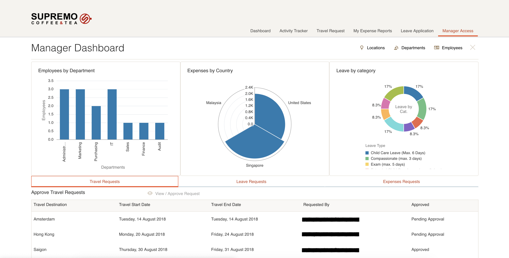

# Cafe Supremo Demo HR Application

## The Cafe Supremo HR Demo App
아래 사진은 데모 어플리케이션 샘플이다.

 

## Demo Application Source
+ [Cafe Supremo 데모 어플리케이션 소스코드 다운로드](resources/materials/Cafe-Supremo-HR.zip)
+ [Cafe Supremo 스토리보드](resources/materials/Cafe-Supremo-VBCS-StoryBoard-Extension-v1.pdf)

## 어플리케이션 임포트 이후 단계

> 위 어플리케이션 소스코드를 성공적으로 임포트 했다고 가정한다.

### Roles 셋업 명령

Role 기반 액세스 컨트롤(RBAC)이 데모에서 구현되었다. 어플리케이션 내에서 navigation 접속을 위해서 다음을 설정해야 한다:

1. 두개의 새로운 그룹을 생성: CF Employee 와 CF Manager
2. Runtime 앱에 접속해야 하는 사용자를 그룹에 할당하십시오. 사용자가 Manager Role인 경우 CF Manager 와 CF Employee 그룹에 사용자를 추가하십시오. Employee Role 인 경우 CF Employee 그룹에 사용자를 추가하십시오.
3. 그룹(CF Employee, CF Manager)을 VBCS의 가상 Role에 연결하십시오.

4. 설정 테스트

