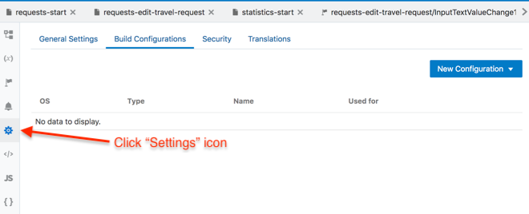

## 11. If You Have Extra Time

> 이 실습에서는 built-in 모바일 어플리케이션 시뮬레이터로 어플리케이션을 실행했습니다. 모바일 어플리케이션 시뮬레이터 화면에서 **‘Build My App’** 옵션이 비활성화 되어있는 것을 볼수 있었습니다.

 

iOS 또는 안드로이드 기기에 설치하기 위한 앱을 생성하기 위해서 Build Configuration 을 생성해야 합니다.

## Android

### Keystpore for Signing app
우리가 만든 모바일 어플리케이션은 안드로이드 디바이스에 디플로이되기 위해서 먼저 인증을 받아야 합니다. 안드로이드 인증 기관이 필요하지는 않습니다. 대신 어플리케이션이 셀프 인증을 할 수 있습니다.

사용할 수 있는 샘플 KeyStore를 생성해 두었습니다. 아래 KeyStore 파일을 다운로드 받으세요.

샘플 Keystore 파일:  <a href="../resources/KSFile/vbcsdoc.keystore">vbcsdoc.keystore</a>

+ Keystore Password: **vbcsdoc_ks_pass**
+ Key alias: **vbcsdoc_ksalias**
+ Key password: **vbcsdoc_ks_pass**

### Configure Application Setting.
KeyStore 파일을 다운로드 했으면 이제 어플리케이션 설정을 구성할 준비가 되었습니다.

**`mytravel`** 모바일 어플리케이션을 클릭합니다.

이렇게 하면 어플리케이션이 새 탭에서 오픈될 것입니다. 다음은 아래 그림과 같이 **`Settings`** 아이콘을 클릭하세요.

**`Build Profiles`** 탭을 클릭합니다.

### Define a Build Configuration

이제 우리는 안드로이드의 신규 프로필을 생성할 것입니다.

**"Android Build Profile"** 다이얼로그 창이 오픈됩니다.

+ 다음 항목들을 입력하세요.
+ Profile Name: **Android**
+ Build Type: **Release**
+ App ID: **변경없음**
+ Version Name: **변경없음**
+ Version Code: **변경없음**

Keystore에서 `Click` 글자를 클릭하고 조금전에 다운받은 KeyStore 파일을 선택합니다. (vbcsdoc.keystore)

이제 다음과 같이 입력합니다.

+ Keystore Password: **vbcsdoc_ks_pass**
+ Key alias: **vbcsdoc_ksalias**
+ Key password: **vbcsdoc_ks_pass**

그리고 마지막으로 **`Default Profole for Stage/Publish`** 체크박스를 선택합니다.

**`Save`** 버튼을 클릭하면 이 다이얼로그 창은 닫히고 다음과 같은 화면을 볼 수 있습니다.

### 모바일 어플리케이션 생성

이제 안드로이드 빌드 프로파일이 구성되었으므로 모바일 어플리케이션을 빌드할 수 있습니다.

아래 그림과 같이 오른쪽에 위치한 미리보기 버튼을 클릭합니다.

어플리케이션이 로드되면 미리보기 화면이 오픈될 것입니다.

오른쪽의 **`Build my App`** 버튼을 클릭해서 빌드를 시작합니다. 빌드 다이얼로그창이 오픈되면 **`Populate Stage with Development data`** 옵션을 선택하고 **`Stage`** 버튼을 클릭합니다.

안드로이드 QR코드가 표시되는데까지 어플리케이션 빌드하는 시간이 좀 소요될 수 도 있습니다. 이제 QR코드를 스캔해서 안드로이드 모바일 디바이스로 앱을 다운로드 받을 수 있습니다.

## iOS
아래는 동일한 모바일 어플리케이션을 iOS 에서는 어떻게 설정하고 빌드하는지 예를 보여줍니다. 이 실습에서는 이 설정을 완료할 수 있는 요소를 제공하지는 않습니다.

모바일 앱의 **`Settings`** 아이콘을 클릭해서 Build Configurations 탭을 클릭합니다.

 
**`New Configuration`** 을 클릭합니다.

아래는 iOS를 위한 예제 입니다.

 

왼쪽 구성 설정은 VBCS의 기본값으로 되어있지만 사용자의 필요에 따라 편집할 수 있습니다.

오른쪽에는 Enterprise 또는 Standard program, 배포 디벨로퍼 프로파일 등 Apple Developer program credentials 을 추가해야 됩니다.

> Note: Apple Developer Program 계정을 받는 방법은 이 실습의 범위가 아니므로 자세한 내용이 필요한 경우 developer.apple.com 사이트를 참고하시면 됩니다.

구성에 프로비저닝 프로파일, 인증서 및 인증서 패스워드 세부정보를 추가합니다. Signing Identity 가 인증서의 Keychain 항목과 정확히 일치하는지 확인하세요. 이를 확인하혀면 Keychain 의 Get Info 를 사용해서 Common Name 속성에서 전체 항목을 복사하세요.

만약 VBCS에 모바일 앱 빌드를 요청할때 이 프로파일을 기본 빌드로 사용하려면 적절한 체크박스를 클릭하세요. (오른쪽 아래)

 

이제 시뮬레이터 실행 앱의 Build My App 버튼이 활성화 되었을 것입니다.

그것을 클릭하면 Stage Application 으로 갈 수 있습니다. 여기서 Business 데이터 배포방법을 선택할 수 있습니다.

만약 첫번째 Stage 배포인 경우 개발데이터를 앱으로 가져가거나 신규 데이터베이스로 시작할 수 있습니다. 첫번째 배포가 아닌 경우는 stage 버전의 데이터를 유지하거나 처음부터 시작하거나 개발 데이터에서 다시 시작하세요.

Once you hit the Stage button (above) the Mobile application is staged and, as it says on the screen, you can scan to install on your device (via the QR scan or by downloading the .ipa file) and start the next stage of your development process
위에 있는 Stage 버튼을 누르면 모바일 어플리케이션이 스테이징 되고 화면에 표시된 것처럼 스캔해서 개인 디바이스에 설치한(QR코드 스캔 또는 .ipa 파일 다운로드를 통해) 후 개발 프로세스의 다음 단계를 시작하세요.

## Congratulations you have completed your myTravel Mobile App using VBCS!

---
> [`HOME`](../README.md) | [`PART 1`](README.md) | [`PART 2`](MOB_PART_2.md) | [`EXTRA`](MOB_EXTRA_1.md) | [`Connecting DevCS`](../DevCS/README.md)
