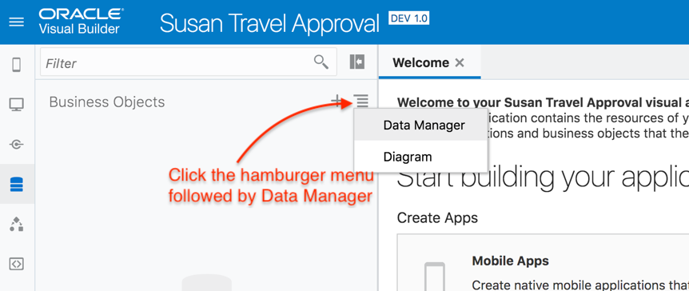
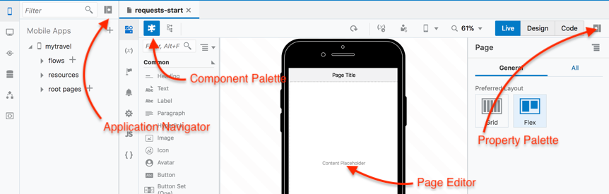

# Building a ''*myTravel*'' Mobile App with Oracle Visual Builder Cloud Service

이 실습에서는 현재 스프레드시트로 처리된 출장 결재 요청 프로세스를 자동화하는 어플리케이션을 생성할 것입니다. 그리고 REST 서비스 호출 및 그 결과를 어플리케이션에 반영할 것입니다.

 

----

## 1. 신규 어플리케이션 생성

**`New`** 버튼 클릭 

어플리케이션의 이름을 입력하세요 –  **`<YourName> Travel Approval`**
 
 

**`Finish`** 버튼을 클릭하여 어플리케이션 생성을 완료하세요.

> *이제 비주얼 어플리케이션을 개발할 수 있는 환경이 되었습니다.*
> *지금부터 모바일 또는 웹 어플리케이션 생성, 외부 REST 서비스에 연결, 다른 프로세스와 통합하거나 자신만의 비즈니스 오브젝트를 생성할 수 있습니다.*

## 2. Business Objects 생성

> *기존에 존재하는 스프레드시트의 데이터를 저장할 Business Objects를 생성하세요. 그런 다음 Business Objects 수정, 필드 추가 그리고 default 값을 설정하고 object간 관계를 생성하십시오.*

Navigator의 왼쪽에 위치한 **`Business Objects`** 아이콘 클릭

> Business Objects navigator 는 왼쪽 패널에서 열린다는 점을 유의하세요

  

Navigator 최상단에 있는 **`Business Objects`** 메뉴버튼 클릭 후 Data Manager 메뉴를 클릭합니다. 이것은 Business Objects 생성하는 빠른 방법 입니다.

 
 
Business Object 스프레드시트(엑셀파일) 다운로드 : <a href="../resources/materials/newFlights.xlsx">Download</a>

다운로드 후, **`Import Business Objects`** 버튼을 클릭으로 엑셀파일 데이터 임포트

  

Import Business Objects wizard 내에서 **newFlights** 엑셀파일 업로드

  

업로드가 완료되면 **`Next`** 버튼을 클릭

import 완료 후 신규 Object ID를 **TravelRequests** 에서 **TravelRequest** 로 변경

  

**`Next`** 클릭

Business Object 의 상세내용 확인을 위해 **`TravelRequest`** 클릭

라벨이 **Date** 인 **date1** 필드의 **Type** 을 **DateTime** 에서 **Date** 로 변경

  

**`Finish`** 버튼을 클릭해서 데이터 임포트를 완료하시고 **`Close`** 를 클릭해서 창을 닫으십시오.

> *Visual Builder는 Business Object를 생성합니다. (데이터베이스에 테이블을 생성, PK(ID)와 audit필드 추가, 엑셀의 데이터를 임포트해서 신규 Business Object 에 CRUD를 수행할 수 있는 REST 서비스 Set을 공개)*

이제 Business Object 를 수정할 수 있습니다.

**Business Object 네이게이터**에서 **`Travel Request`** 버튼을 클릭해서 에디터를 연다.

**`Fields`** 탭 클릭

**`+ New Field`** 버튼을 클릭해서 해당 Business Object 에 신규 필드를 추가합니다.

 

**Boolean** 타입의 필드 **Approved** 를 추가합니다.

 

**Approved** 필드가 선택된 상태에서, **Value Calculation** 섹션까지 **Property Palette** 스크롤을 내립니다. **Approved** 필드의 **Set to default if value not provided** 값을 **false** 상태로 설정합니다.

 

**`Airline`** Business Object를 클릭, **Fields** 탭 선택, **Airline** 이라는 필드가 추가된 것에 주목합니다.

 
**`Travel Request`** Object 를 다시 클릭합니다.

필드 추가: **Airline** Business Object 의 **Reference** 타입 필드인 **Airline**. 자동으로 조회되는 참조 Business Object의 필드값을 선택하는 방법으로 수행합니다.

**Airline** 필드를 Default Display Field로 선택하세요.

 

**`Endpoints`** 탭을 클릭.

> 앱에서 Business Object에 접속하기 위해 제공된 REST Endpoint를 확인하세요.

 

다시 **Airline** object를 클릭하세요.

필드 추가: airline의 air travel 청구비용 전체합을 보여줄 **Number** 타입의 **Total Cost**

 

**Total Cost** 필드를 선택한 상태에서 Property Palette의 Value Calculation 섹션으로 이동한 뒤 **`(*) Aggregate from related object data`** 를 선택합니다.

 

**`+ Edit Aggregation`** 버튼 클릭. Object to Aggregate 항목이 **Travel Request (using airline)** 으로 되어 있는지 확인하세요. Aggregation Function 은 **`Total`** 을 선택하고 Field to Aggregate 는 **`Cost`** 를 선택합니다.

**`OK`** 버튼 클릭

필드추가: airline Object의 출장경비 중 항공편 요청의 총 비용을 보여주는 **Number** 타입인 **Average Cost**

다시 Average Cost 필드 선택 후 Property Palette 의 Value Calculation 섹션으로 가서 **`(*) Aggregate from related object data`** 를 선택합니다.

Travel Request object에서 **`Average`** 를 function 으로 선택하고 **`Cost`** 를 합계를 계산할 field로 선택합니다.

 

## 3. Mobile Application 생성

> 이번 섹션에서는 이전에 생성한 Business Object를 사용해서 출장 승인 프로세스를 수행할 수 있는 모바일 어플리케이션을 생성할 예정입니다.

Navigator의 **`Mobile Apps`** 아이콘을 클릭후 **`+ Mobile Application`** 버튼을 클릭합니다. (편집기에서 열었던 탭은 닫아도 됨)

 

**Mobile Application** 이름은 **`myTravel`** 으로 입력합니다.

**Navigation Style** 은 default값인 Bottom Bar로 선택하고 **Navigation Items** 항목은 Requests와 Statistics는 그대로 두고 세번째 Items은 삭제한 뒤 **`>`**	버튼을 클릭합니다.

이제 home screen의 default layout을 선택할 수 있습니다. **No Content** 선택 후  **``Finish``** 를 클릭하세요.

 

**Application Navigator** 에서 **`mytravel`** 를 펼쳐주세요.

> *VBCS는 지금까지 지정한 각 Navigation Items 대한 구성도를 생성했습니다. 또한 각 flow 마다 home screen을 생성했고 첫번째 화면인 request-start가 오픈되었습니다. 이것이 어플리케이션의 시작지점 입니다.*

필요한 경우 접기 아이콘을 클릭해서 **Application Navigator** 와 **Page Structure** 뷰어를 닫을 수 있습니다.

 

> ***Visual Page Editor** 화면구성 입니다. 왼쪽편은 **Component Palette** 이고, 메인영역은 **Page Editor** 그리고 오른쪽은 **Property Palette** 입니다.* 

만약 **Property Palette** 가 보이지 않으면 **Code** 버튼의 오른쪽에 위치한 **Expand** 아이콘을 클릭하세요.

> 현재 **Live** mode 임을 유의하세요 (나중에 다시 설명). 원하는대로 다른 layout 모드에서 모바일 앱을 클릭해보세요.

 
**Design 탭** 이 선택되어 있는지 확인하세요. 에디터에서 **`Page Title`** 선택 후 **Properties** 에서 Page Title을 *"Requests"* 로 입력하세요.

 

Component Palette 의 Collection 섹션에서 **List View** 를 페이지 위로 드래그 하세요.

 

## 4. 화면으로 데이터 바인드

> *이 섹션에서는 화면의 요소를 데이터에 바인딩 해봅니다. 이 케이스에서의 데이터는 **TravelRequest** Business Object 를 의미합니다. 엑셀파일에서 데이터를 가져올 때 Business Object의 일부분으로 생성된 REST Endpoints를 사용해서 실제 테이블의 데이터에 접근하고 업데이트 합니다.*

**Property Palette** 에서, **Quick Start** 탭(the educator icon)은 기본적으로 오픈된 상태입니다 (만약 그렇지 않다면 아이콘을 클릭하세요) 여기에서 list view 에 빠르게 데이터에 바인딩을 할 수 있습니다.

 

**`Add Data`** 버튼을 클릭하세요.

**TravelRequest** Business Object 를 선택한 후 **`Next`** 를 클릭하세요.

이제 **List Item** 템플릿을 선택후 **`Next`** 버튼을 클릭하세요.

 페이지에서 표시될 **필드** 들을 드래그 앤 드랍 합니다.: **`Picture, Name, To1, Cost, Airline`** 필드를 아래 이미지에 표시된 Template Fields 로 이동합니다.

> Airline Object 에서 참조하는 필드인 airline 필드를 선택해야 하는 경우에는 **AirlineObject** 와 **Items** 항목을 차례로 펼친 후 나타나는 text item인 airline을 선택하는 것임을 주의합니다. (아래 그림 참조)

 

**`Next`** 버튼 클릭 후 **`Finish`** 버튼 클릭

> 현재 선택된 Editor 가 Design 뷰이더라도 화면에는 Business Object의 실제 데이터가 보여집니다.

 

### 페이지 수정기능 추가

**ListView의 Property Inspector** 에서 **`Add Edit Page`** 를 클릭합니다.

이 수정 페이지의 소스 데이터로 **TravelRequest** Business Object 선택 후 **`Next`** 클릭

Update Endpoint도 동일 – **TravelRequest** Business Object 선택 후 **`Next`** 클릭

**수정 페이지** 에서 표시될 필드 선택: **`picture, name, approved, date1, cost, airline, to1`**. 드래그앤 드랍으로 필드들의 순서를 변경할 수 있습니다.
> 참조필드인 airline 항목을 선택해야합니다. airlineObject를 선택하지 않게 주의하세요.
 

**`Finish`** 클릭

### Requests 페이지에서 수정 페이지 호출

> *이제 Requests 페이지의 record에서 수정 페이지를 호출하기 위한 request를 설정 합니다.*

**Page Structure** 에서 **List View** component 를 선택하거나 **Page Editor** 에서 직접 선택하세요.

 

List View의 General Properties에서 **`Selection Mode`** 를 **Single** 로 선택하세요.

 

### Event 생성 및 매핑

> *이제 **`Request`** 페이지에서 각각의 단일 레코드가 선택될때 발생하는 **Event** 를 생성할 것입니다.

Property Inspector에서 **`Events`** 탭을 선택하세요. **`New Event`** 클릭 후 **`Quick Start: selection`** 를 선택하세요.

  

> *이제 Visual Action Flow Diagram 입니다. 여기서는 리스트의 특정 Row를 선택했을때 발생하는 Event 프로세스를 매핑할 수 있습니다.*

Navigate 컴포넌트를 에디트창으로 드래그한 후 Property Inspector 의 **'Select Target'** 버튼을 클릭합니다.

 

이전에 만든 에디터 페이지를 찾기위해 Peer Pages를 선택한 후 **requests-edit-travel-request** 를 선택하세요. (에디트 페이지를 변경한 경우 변경한 이름 선택)

**`Select`** 버튼 클릭

 

이제 **Property Inspector** 의 **Input Parameters > Assign** 를 클릭해서 선택한 row ID의 에디터 페이지가 오픈되도록 합니다.
 

Action mapper의 Sources에서 Action Chain을 확장하여 선택된 **`Item`** 을 찾으세요. 드래그 앤 드랍하여 **travelRequestId**에 매핑하세요.

**`Save`** 클릭

 

> 이제 특정 row가 선택 됐을때 그 row의 상세 에디트 페이지를 오픈하는 액션을 생성했습니다.

### 어플리케이션 시뮬레이터 실행

> *이제 어플리케이션을 실행할 준비가 다 되었습니다.*

윈도우 상단 오른쪽 메뉴 아이콘에서 **`Run`** 버튼 클릭

  

행을 선택한 후 에디트 페이지로 이동, **Airline** 을 선택 및 **Save** 등 원하는 대로 여러 요청 및 업데이트 필드를 반복해보세요.

> *현재 시뮬레이터에서 앱을 실행하고 있습니다. 이 핸즈온의 마지막에는 디바이스에 어플리케이션을 빌드하고 설치하는 방법을 설명하는 섹션이 있습니다.*

윈도우 상단의 드랍다운 버튼에서 모바일 디바이스 유형을 선택하여 모바일 앱이 여러 종류의 디바이스에서 랜더링 가능하다는 것도 확인해보세요.

## 5. Page Designer 에서 어플리케이션 시뮬레이터 실행

*Page Designer에서 어플리케이션을 실행하면 설계하는 동안 라이브 데이터에 액세스할 수 있으므로 페이지가 원하는 대로 흘러가는지 여부뿐만 아니라 데이터 및 데이터 간의 관계가 예상대로 되었는지 테스트할 수 있습니다.*

인터넷 브라우저에서 **Oracle Visual Builder Cloud Service** 작업 탭으로 돌아갑니다.

**`requests-start`** 탭 클릭

**`Live`** 버튼을 클릭해서 Live 모드로 변경합니다.

레코드를 선택해서 수정 페이지를 오픈합니다.

  

**`Design`** 버튼을 클릭해서 Design 모드로 돌아갑니다.

## 6. Layout 변경 

> *이 섹션에서는 UI페이지의 Page Editor 와 Page Structure를 사용해서 작업합니다.*

**TravelRequest** 에디터 페이지에서 **Property Palette** 를 접고 **Page Editor** 캔버스를 확대합니다.

  

***Page Structure** 에서 페이지의 첫번째 요소는 default 레이아웃과 에디트 페이지 생성시 선택한 항목이 포함된 **`Flex Container`** 입니다.*

**Component Palette** 의 **'Layout'** 섹션에서 **Flex Container** 를 선택해 **Page Structure** 의 **Mobile Page Template** 아래의 Top Level로 드래드 앤 드랍 합니다.

> **Flex Row** 로 이름을 변경

  

Page Structure 또는 Editor에서 직접 3개의 Flex Containers 를 Flex Row의 하뤼로 드래그앤드랍 합니다.

> 참고 - 필요한경우 상단 오른쪽 메뉴의 Back arrow를 사용하여 단계를 다시 확인해보세요.

  

**Component Palette** 의 **'Common'** 섹션에서 **Avatar** 를 첫번째 **Flex Container** 로 그래그 앤 드랍 하세요.

Avatar 를 선택한 후 오른쪽 **Property Palette** 의 **`Data Tab`** 을 선택하세요.

이제 Avatar UI 항목에 데이터를 바인딩 할 것입니다. 

**Src** 박스위의 드랍다운 화살표를 클릭하세요.

  

이 페이지에서 사용가능한 변수들이 보여집니다. **travelRequestRecord** 의 **picture** 를 선택하세요. 이것은 선택한 레코드의 이미지 URL 입니다.

  

**Page Editor** 에서 **Name** 항목을 Avatar 아래로 드래그 앤 드랍으로 이동합니다. label 필드가 아닌 name 필드임을 유의합니다.

  

이제 default 텍스트 필드의 **Picture** URL 항목을 선택 후 삭제 하세요.

**`Approved`** 필드를 오른쪽 **Flex Container** 으로 이동 하세요. 

  

**Page Structure** 에서는 **Flex Container** 기본적으로 **Form Layout** 를 포함하고 있습니다. **Flex Container** 를 선택하세요.

  

아래 그림과 같이 **Component Palette** 에서 또 다른 **Flex Container** 를 기존의 **Flex Container** 하단으로 드래그하세요. 또는 Page Structure로 직접 드래그하세요.(Page Structure 에서 드래그해서 항목들을 재정렬할 수 있습니다.)

어느 방법을 선택하든 **Structure Pane** 는 아래와 같이 **Flex Container** 아래 **Form Layout** 과 신규 **Flex Container** 가 존재하는 구조로 되어야 합니다.

 

신규 **Flex Container** 선택 후 **'Component Palette'** 의 **'Common'** 섹션에 있는 **Image** 컴포넌트를 추가하세요.

이제 **Image** 아래 **Form Layout** 가 추가하고 **Page Structure** 를 사용해서 구성 요소를 이동하세요.

 
**Image** 를 선택해서 **Width** 를 **250** 으로 **Height** 를 **150** 으로 변경하세요.

**Form Layout** 을 선택 후 2개의 **Input Text** 필드를 추가하세요. 각각은 **Country** 와 **Capital** 으로 설정합니다. 신규 Number Input 필드를 추가하고 이름을 **Population** 로 정합니다. 이들 모두 **Property Palette** 에서 **Readonly** 로 설정해주세요.

 

> *다음 섹션에서는 외부 REST 서비스를 통해 이 새 필드들을 채울것입니다.*

## 외부 REST 서비스 호출

> *이제 현재 페이지에서 방문할 국가에 대한 몇가지 추가정보를 제공하기 위해 외부 REST 서비스를 호출할 것입니다.*

좌측의 **Application Navigator** 를 펼치고 **Service Connections** 를 클릭합니다. 

 

신규 접속을 생성하기 위해 **+ Service Connection** 를 클릭합니다.

**Define by Endpoint** 선택

URL 항목에 https://restcountries.eu/rest/v2/alpha/{code} 를 입력합니다.

**Action Hint** 는 **Get One** 을 선택합니다.

 

*이것은 앞으로 호출할 REST 서비스 입니다. 이 서비스는 국가코드를 파라메터로 요청받고 그 국가의 정보를 리턴합니다.*

**`Next`** 버틀 클릭

**Service** 탭에서 service 이름을 **GetCountry** 로 입력합니다.

**Test** 탭에서 **URL Parameters** 에서 value 값을 **US** 로 입력합니다.

**Send** 버튼을 클릭해서 해당 서비스를 테스트 하고 해당 국가의 정보가 정상적으로 리턴되는지 체크합니다.

UK, DE, FR, BR, JP 와 같은 다른 국가코드도 입력해서 테스트 해봅니다.

**Copy to Response Body** 버튼을 클릭합니다.

**Response** 탭을 클릭하면 **Test** 탭에서 수행한 **GetCountry** 의 리턴값 양식을 Example 항목에서 볼 수 있습니다. 

 
 
**Create** 버튼을 클릭해서 서비스를 생성합니다. Visual BUilder 내부에 어플리케이션에서 호출하고 리턴된 데이터에 접근할 수 있는 서비스가 생성됩니다.

### Service 기반의 변수 생성

> *REST 서비스에서 리턴된 데이터를 사용하기 위해서는 리턴된 데이터의 포멧 기반의 Type 을 생성해야 합니다. 그리고나서 해당 페이지에서 사용되는 Type에 기반한 변수를 생성합니다.*

에디트 페이지의 테두리에 있는 **`Variables`** 아이콘을 클릭한 뒤 **Types** 탭을 선택하세요.

 

**`+ Type`** 드랍다운 버튼을 클릭한 뒤 **From Endpoint** 를 선택합니다.

**Service Connections** 과 **`GetCountry`** 을 펼쳐서 **`GET`** 을 선택합니다.

 

**`Next`** 클릭

**Define Type** 이름을 **`CountryType`** 로 입력하고 **Response** 왼쪽의 체크박스를 선택해 해당 서비스에서 리턴되는 모든 속성들을 다 체크합니다.

**`Finish`** 버튼 클릭

 

**`Variables`** 탭을 클릭해서 **CountryType** 항목에 기반한 **Variable** 를 생성합니다.

**`+ Variable`** 클릭

 

ID는 **CountryVar** 로 입력하고 type 으로는 **CountryType** 를 선택합니다.

**`Create`** 버튼 클릭

 

### Connect the Page Fields to the Variable

> *이제 페이지에서 정의한 필드를 생성한 변수와 연결한 준비가 되었습니다.*

**Page Designer** 로 돌아갑니다.

**Page Structure** 에서 **`Country`** 필드를 선택하세요.

**Property Palette** 에서 **Data** 탭을 선택하세요.

**Expression Editor** 을 열어서 **`CountryVar`** 변수의 **`name`** 필드를 선택합니다.

 

Capital, Population, Flag 필드에도 이와같이 수행합니다.

## 7. Use an Event to Call the REST Service from the Page

> *마침내 페이지에서 REST 서비스를 호출할 준비가 되었습니다. 이 예제에서는 특정 필드값이 입력됐을 REST 서비스를 호출하는 이벤트를 생성할 예정입니다.*

Property Palette에서 **`To`** 필드를 선택한 후 **Events** 탭으로 이동하세요.

**New Event** 드랍다운 버튼 클릭후 **Quick Start: ‘value’** 를 선택합니다.

이제 **Actions Visual Flow Editor** 화면이 나타납니다.

**Actions** 팔레트에서 **Call Rest Endpoint** 항목을 ‘+’ 위로 드래그 합니다.

  

우측의 **`Select Endpoint`** 를 클릭합니다.

**Service Connections** , **GetCountry** 를 펼쳐서 **Get** 을 선택합니다.

 

**`Select`** 버튼클릭

우측의 **Property Palette** 에서 ID를 **CallCountryService** 로 입력합니다.

### Input Parameter 매핑

*REST 서비스는 country 파라메터가 필요합니다. 이를 위해 REST 서비스 호출시 해당 페이지의 country code 인 ‘To’ 필드를 파라메터로 매핑합니다.*

우측의 **Input Parameter** 항목의 **`Assign`** 를 클릭합니다.
 

**Sources** 부분에서 **Page > travelRequestRecord** 에 있는 **`to1`** 값을 해당 서비스에서 요구되는 **Target** 쪽의 **`code`** 항목으로 연결합니다.

 

**`Save`** 버튼 클릭

### 리턴값을 페이지 변수에 할당하기

> *이제 REST 서비스를 호출한 리턴값을 응답데이터 포멧에 맞추어 페이지의 변수에 매핑합니다.*

**`Assign Variable`** action 을 이 흐름의 다음 스텝위에 드래그 앤 드랍 합니다.

 

**Property Palette** 에서 Variables 의 **`Assign`** 링크를 클릭합니다.

Sources 쪽의 **Results – CallCountryService – body** 항목을 Target 쪽의 **Page – CountryVar** 항목으로 연결합니다.

 

**`Save`** 버튼을 클릭해 페이지 에디터 화면으로 돌아갑니다.

### 완료!

> *이제 페이지에서 정의한 GetCountry REST 서비스에 대한 호출 설정을 완료했습니다. 해당 서비스에 파라메터를 전달했습니다. REST 서비스에서 리턴되는 데이터 형식을 기반으로 한 변수를 생성했습니다. 페이지의 필드에 변수값으로 매핑한 리턴데이터로 변수값을 채웁니다.*

## 8. 완성된 어플리케이션 실행

**`Run`** 버튼을 클릭해서 어플리케이션을 실행합니다.

특정 Row를 클릭해 **`Edit TravelRequest`** 페이지를 오픈합니다.

목적지 국가를 다른 국가(ISO코드)로 변경해서 국가 필드의 데이터가 업데이트 되는지 확인해봅니다.

### 이 실습의 Part 2 를 수행하세요.

---
> [`HOME`](../README.md) | [`PART 1`](README.md) | [`PART 2`](MOB_PART_2.md) | [`EXTRA`](MOB_EXTRA_1.md) | [`Connecting DevCS`](../DevCS/README.md)
