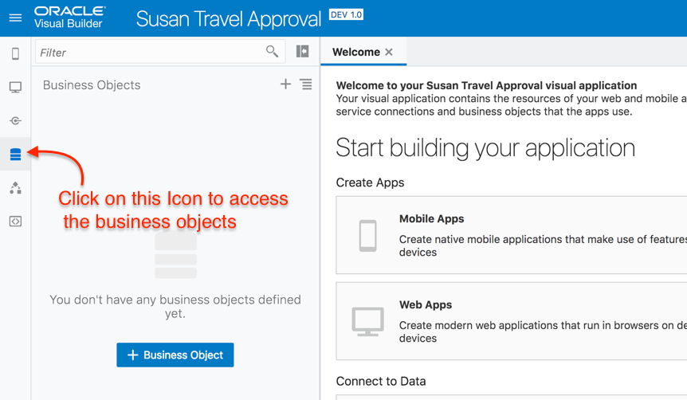
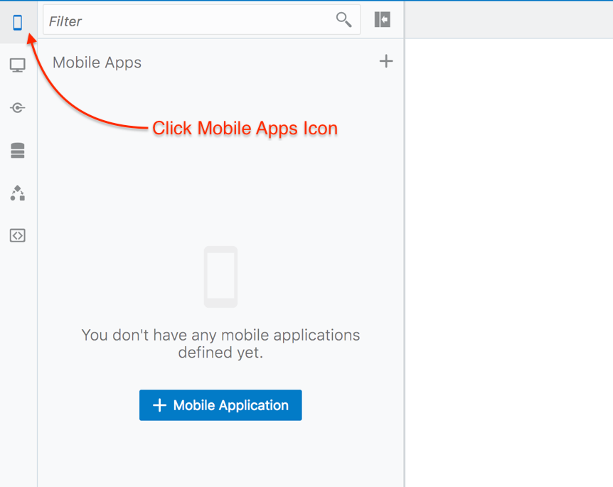
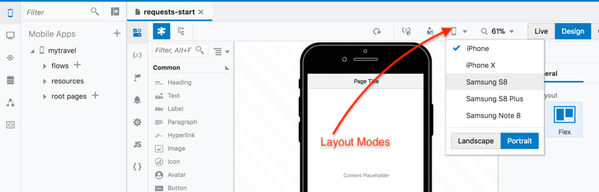

# Building a ''*myTravel*'' Mobile App with Oracle Visual Builder Cloud Service

이 실습에서는 현재 스프레드시트로 처리된 출장 결재 요청 프로세스를 자동화하는 어플리케이션을 생성할 것입니다. 그리고 또한 REST 서비스 호출 및 그 결과를 어플리케이션에 반영할 것입니다.

 

----

## 1. Create a new Application

**`New`** 버튼 클릭

어플리케이션의 이름을 입력하세요 –  **`<YourName> Travel Approval`**
 
 

**`Finish`** 버튼을 클릭하여 어플리케이션 생성을 완료하세요.

> *이제 비주얼 어플리케이션을 개발할 수 있는 환경이 되었습니다.*
> *지금부터 모바일 또는 웹 어플리케이션 생성, 외부 REST 서비스에 연결, 다른 프로세스와 통합하거나 자신만의 비즈니스 오브젝트를 생성할 수 있습니다.*

## 2. Create Business Objects

> *기존에 존재하는 스프레드시트의 데이터를 저장할 Business Objects를 생성하세요. 그런 다음 Business Objects 수정, 필드추가 그리고 default 값을 설정하고 object간 관계를 생성하십시오.*

Navigator의 왼쪽에 위치한 **`Business Objects`** 아이콘 클릭

> Business Objects navigator 는 왼쪽 패널에서 열린다는 점을 유의하세요

  

Navigator 최상단에 있는 Business Objects **`Business Objects`** 메뉴버튼 클릭 후 Data Manager 메뉴를 클릭합니다. 이것은 Business Objects 생성하는 빠른 방법 입니다.

 
 
Business Object 스프레드시트(엑셀파일) 다운로드 : <a href="../resources/materials/newFlights.xlsx">Download</a>

다운로드 후, **`Import Business Objects`** 버튼을 클릭으로 엑셀파일 데이터 임포트

  

Import Business Objects wizard 내에서 **newFlights** 엑셀파일 업로드

  

업로드가 완료되면 **`Next`** 버튼을 클릭

임포트 후 새 Object ID를 **TravelRequests** 에서 **TravelRequest** 로 변경

  

**`Next`** 클릭

Business Object 의 상세한 내용을 확인하려면 **`TravelRequest`** 클릭

**Date** 로 표시된 필드의 **Type** 을 **DateTime** 에서 **Date** 로 변경

  

**`Finish`** 버튼을 클릭해서 데이터 임포트를 완료하시고 **`Close`** 를 클릭해서 창을 닫으십시오.

> *Visual Builder는 Business Object를 생성한다. (데이터베이스에 테이블을 생성, PK(ID)와 audit필드 추가, 엑셀의 데이터를 임포트해서 신규 Business Object 에 CRUD를 수행할 수 있는 REST 서비스 Set을 공개)*

이제 Business Object 를 수정할 수 있습니다.

**Business Object 네이게이터**에서 **`Travel Request`** 버튼을 클릭해서 에디터를 연다.

**`Fields`** 탭 클릭

**`+ New Field`** 버튼을 클릭해서 해당 Business Object 에 신규 필드를 추가합니다.

 

**Boolean** 타입의 필드 **Approved** 를 추가합니다.

 

**Approved** 필드가 선택된 상태에서, **Value Calculation** 섹션까지 **Property Palette** 스크롤을 내립니다. **Approved** 필드의 **Set to default if value not provided** 값을 **false** 상태로 설정합니다.

 

**`Airline`** Business Object를 클릭, **Fields** 탭 선택, **Airline** 이라는 필드가 추가된 것에 주목합니다.

 
**`Travel Request`** Object 를 다시 클릭합니다.

다른 필드 추가: **Airline** Business Object 의 **Reference** 타입 필드인 **Airline**. 자동으로 ID 필드를 사용해서 이 작업을 수행합니다.

**Airline** 필드를 Default Display Field로 선택하세요.

 

**`Endpoints`** 탭을 클릭.

> 앱에서 Business Object에 접속하기 위해 노출된 REST Endpoint를 주목하세요.

 

다시 **Airline** object를 클릭하세요.

필드 추가: airline의 air travel 청구비용 전체합을 보여줄 **Number** 타입의 **Total Cost**

 

**Total Cost** 필드를 선택한 상태에서 Property Palette의 Value Calculation 섹션으로 이동한 뒤 **`(*) Aggregate from related object data`** 를 선택한다.

 

**`+ Edit Aggregation`** 버튼 클릭. Object to Aggregate 항목이 **Travel Request (using airline)** 으로 되어 있는지 확인하세요. Aggregation Function 은 **`Total`** 을 선택하고 Field to Aggregate 는 **`Cost`** 를 선택합니다.

**`OK`** 버튼 클릭

필드추가: airline Object의 출장경비 중 항공편 요청의 총 비용을 보여주는 **Number** 타입인 **Average Cost**

다시 Average Cost 필드 선택 후 Property Palette 의 Value Calculation 섹션으로 가서 **`(*) Aggregate from related object data`** 를 선택합니다.

Travel Request object에서 **`Average`** 를 function 으로 선택하고 **`Cost`** 를 합계를 계산할 field로 선택합니다.

 

## 3. Create the Mobile Application 

> 이번 섹션에서는 이전에 생성한 Business Object를 사용해서 출장 승인 프로세스를 수행할 수 있는 모바일 앱을 생성할 예정입니다.

네비게이터의 **`Mobile Apps`** 아이콘을 클릭후 **`+ Mobile Application`** 버튼을 클릭 (편집기에서 열었던 탭은 닫아도 됨)

 

**모바일 어플리케이션** 이름은 **`myTravel`** 으로 정함

**Navigation Style** 은 default값인 Bottom Bar로 선택하고 **Navigation Items** 항목은 Requests와 Statistics는 그대로 두고 세번째 Items은 삭제한 뒤 **`>`**	버튼을 클릭합니다.

이제 home screen의 default layout을 선택할 수 있습니다. **No Content** 선택 후  **``Finish``** 를 클릭하세요.

 

**Application Navigator** 에서 **`mytravel`** 를 펼쳐주세요.

> *VBCS는 지금까지 지정한 각 Navigation Items 대한 구성도를 생성했습니다. 또한 각 flow 마다 home screen을 생성했고 첫번째 화면인 request-start가 오픈되었습니다. 이것이 어플리케이션의 시작지점 입니다.*.

필요한 경우 접기 아이콘을 클릭해서 **Application Navigator** 와 **Page Structure** 뷰어를 닫을 수 있습니다.

 

> ***Visual Page Editor** 화면구성 입니다. 왼쪽편은 **Component Palette** 이고, 메인영역은 **Page Editor** 그리고 오른쪽은 **Property Palette** 입니다.* 

만약 **Property Palette** 가 보이지 않으면 **Code** 버튼의 오른쪽에 위치한 **Expand** 아이콘을 클릭하세요.

> 현재 **Live** mode 임을 유의하세요 (나중에 다시 설명). 선호하는 대로 다른 레이웃 모드에서 모바일 앱을 클릭해보세요.

 
**Design Tab** 이 선택되어 있는지 확인하세요. 에디터에서 **`Page Title`** 선택 후 **Properties** 에서 Page Title을 *"Requests"* 로 입력하세요.

 

Component Palette 의 Collection Section 에서 **List View** 를 페이지 위로 드래그 하세요.

 

## 4. Bind Data to the Screen

> *이 섹션에서는 화면의 요소를 데이터에 바인딩 해봅니다. 이 케이스에서의 데이터는 **TravelRequest** Business Object 를 의미합니다. 엑셀파일에서 데이터를 가져올 때 Business Object의 일부분으로 생성된 REST Endpoints를 사용해서 실제 테이블의 데이터에 접근하고 업데이트 합니다.*.

**Property Palette** 에서, **Quick Start** 탭(the educator icon)은 기본적으로 오픈된 상태입니다 (만약 그렇지 않다면 아이콘을 클릭하세요) 여기에서 list view 에 빠르게 데이터에 바인딩을 할 수 있습니다.

 

**`Add Data`** 버튼을 클릭하세요.

**TravelRequest** Business Object 를 선택한 후 **`Next`** 를 클릭하세요.

이제 **List Item** 템플릿을 선택후 **`Next`** 버튼을 클릭하세요.

 페이지에서 표시될 **Fields** 드래그앤드랍: **`Picture, Name, To, Cost and Airline`** 필드는 아래 이미지에 표시된 Template Fields 로 이동

> Airline의 경우 A object를 참조하는 Airline 항목을 선택하는 경우  – you want to select the Airline from the referenced **Airline** object – by expanding the **AirlineObject** and the **Items** to use the text item Airline

참조된 airline object에서 airline 항목을 선택해야 하는 경우에는 **AirlineObject** 와 **Items** 항목을 차례로 펼친 후 나타나는 text item인 Airline을 선택하는 것임을 주의한다 (아래 그림 참조)

 

**`Next`** 버튼 클릭 후 **`Finish`** 버튼 클릭

> 현재 선택된 Editor 가 Design 뷰이더라도 화면에는 Business Object의 실제 데이터가 보여집니다.

 

### Add an Edit Page

**Table Property Inspector** 에서 **`Add Edit Page`** 를 선택

이 편집 페이지의 소스 데이터로 **TravelRequest** Business Object 선택 후 **`Next`** 클릭

Update Endpoint도 동일 – **TravelRequest** Business Object 선택 후 **`Next`** 클릭

**Edit Page** 에서 표시될 필드 선택: **`picture, name, approved, date1, cost, airline, to1`**. 드래그앤 드랍으로 필드들의 순서를 변경할 수 있습니다.
> 참조필드인 airline 항목을 선택해야함. airlineObject를 선택하지 않게 주의하세요.
 

**`Finish`** 클릭

### Call the Edit Page from the Requests page

> *이제 Requests 페이지의 record에서 Edit page를 호출하기 위한 request를 설정 합니다.*

**Page Structure** 에서 **List View** component 를 선택하거나 **Page Editor** 에서 직접 선택하세요.

 

List View의 General Properties에서 **`Selection Mode`** 를 **Single** 로 선택하세요.

 

### Create And Map An Event

> *이제 **`Request`** 페이지에서 각각의 단일 레코드가 선택될때 발생하는 **Event** 를 생성할 것입니다.

Property Inspector에서 **`Events`** 탭을 선택하세요. **`New Event`** 클릭 후 **`Quick Start: selection`** 를 선택하세요.

  

> *이제 Visual Action Flow Diagrammer 입니다. 여기서는 리스트의 특정 Row를 선택했을때 발생하는 정확한 이벤트 프로세스를 매핑할 수 있습니다.*

Navigate 컴포넌트를 에디터창으로 드래그한 후 Property Inspector 의 **'Select Target'** 버튼을 클릭합니다.

 

이전에 만든 에디터 페이지를 찾으려면 Peer Pages를 선택한 후 **requests-edit-travel-request** 를 선택하세요. (에디트 페이지를 변경한 경우 변경한 이름 선택)

**`Select`** 버튼 클릭

 

이제 **Property Inspector** 의 **Input Parameters > Assign** 를 클릭해서 선택한 row ID의 에디터 페이지가 오픈되도록 합니다.
 

Action mapper의 Sources에서 Action Chain을 확장하여 선택된 **`Item`** 을 찾으세요. 드래그 앤 드랍하여 **travelRequestId**에 매핑하세요.

**`Save`** 클릭

 

> 이제 특정 row가 선택 됐을때 그 row의 상세 에디트 페이지를 오픈하는 액션을 생성했습니다.

### Run The Application in a Simulator

> *이제 어플리케이션을 실행할 준비가 다 되었습니다.*

윈도우 상단 오른쪽 메뉴 아이콘에서 **`Run`** 버튼 클릭

  

행을 선택한 후 에디트 페이지로 이동 - **Airline** 을 선택 및 **Save** , 원하는 대로 여러 요청 및 업데이트 필드에 반복

> *현재 시뮬레이터에서 앱을 실행하고 있습니다. 이 Hands On Lab의 끝에는 디바이스에 앱을 빌드하고 설치하는 방법을 설명하는 섹션이 있습니다.*

윈도우 상단의 드랍다운에서 모바일 디바이스 유형을 선택하여 모바일 앱이 여러 종류의 디바이스에서 랜더링되는 방법 보기

## 5. Simulate Running the App in the Page Designer

*Page Designer에서 어플리케이션을 실행하면 설계하는 동안 라이브 데이터에 액세스할 수 있으므로 페이지가 원하는 대로 흘러가는지 여부뿐만 아니라 데이터 및 데이터 간의 관계가 예상대로 되었는지 테스트할 수 있다.*

브라우저 탭을 통해서 **Oracle Visual Builder Cloud Service** 설계 시점으로 돌아감

**`requests-start`** 탭을 클릭

**`Live`** 버튼을 클릭해서 Live 모드로 돌아감

레코드를 선택해서 에디트 페이지를 오픈

  

**`Design`** 버튼을 클릭해서 Design 모드로 돌아갑니다.

## 6. Edit the Layout 

> *이 섹션에서는 UI페이지의 Page Editor 와 Page Structure를 사용해서 작업합니다.*

**TravelRequest** 에디터 페이지에서 **Property Palette** 를 접고 **Page Editor** 캔버스를 확대

  

***Page Structure** 에서 페이지의 첫번째 요소는 default 레이아웃과 에디트 페이지 생성시 선택한 항목이 포함된 **`Flex Container`** 입니다.*

From the **'Layout'** section of the **Component Palette** drag and drop a new top level **Flex Container** into the **Page Structure** – below the **Mobile Page Template**

**Component Palette** 의 **'Layout'** 섹션에서 **Flex Container** 를 선택해 **Page Structure** 의 **Mobile Page Template** 아래의 Top Level로 드래드앤드랍 합니다.

> **Flex Row** 로 이름을 변경

  

Page Structure 또는 Editor에서 직접 3개의 Flex Containers 를 Flex Row의 하뤼로 드래그앤드랍 합니다.

> 참고 - 필요한경우 상단 오른쪽 메뉴의 Back arrow를 사용하여 단계를 다시 확인해보세요.

  

From the **'Common'** section of the **Component Palette** drag and drop an **Avatar** into the first **Flex Container**
**Component Palette** 의 **'Common'** 섹션에서 **Avatar** 를 첫번째 **Flex Container** 로 그래그앤드랍 하세요.

With the Avatar selected, expand the **Property Palette**, select the **`Data Tab`**

Now you are going to bind data to this avatar UI element 

Click the dropdown arrow above the **Src** box

  

The variables available for this page are presented to you. From the **travelRequestRecord** select **picture**. This is a URL to an image of the selected person record

  

In the **Page Editor** drag the **`Name`** below the Avatar. Note – the name field, not the label

  

Now select and delete the **Picture** URL to remove that default text field

Drag the **`Approved`** field into the right-hand **Flex Container** 

  

In the **Page Structure**, note that by default, there is a **Flex Container** surrounding the **Form Layout**. Select that **Flex Container**

  

From the **Component Palette** drag another **Flex Container** into the bottom of that existing Flex Container, as show in the image below. Alternatively, drag it directly into the Page Structure (you can re-order elements by dragging them within the Page Structure)

Whichever method you choose, the **Structure Pane** should look like this – one **Flex Container** that contains both the **Form Layout** and a new **Flex Container**

 

With the new **Flex Container** selected, add an **Image** component into it from the **'Common'** section of the **'Component Palette'**

Now add a **Form Layout** below the **Image**, use the **Page Structure** directly to move components around

 

Select the **Image** and change the **Width** property to **250** and the **Height** property to **150**

Select the **Form Layout** and add 2 **Input Text** fields – label them **Country** and **Capital**. Add a Number Input field and label it **Population**. In the **Property Palette for each of these items, set them to **Readonly**

 

> *In the next section you are going to populate these new fields from an external REST service*

## Call an External REST Service

> *Now you are going to call an external Rest Service from this page to provide some additional information about the country to be visited*

Expand the **Application Navigator** and open **Service Connections** 

 

Click on **+ Service Connection** to create a new connection

Click **Define by Endpoint**

In URL add https://restcountries.eu/rest/v2/alpha/{code}

In **Action Hint** select **Get One**

 

*This is the REST service you will call. The service requires a parameter (country code) and it will return data about that country*

Click **`Next`**

Under the **Service** tab, name the service **GetCountry**

Under the **Test** tab, select **URL Parameters** and add a value of **US** 

Click **Send** to test the service and check that the correct country information is returned 

Try this again with different country codes such as UK, DE, FR, BR, JP

Click **Copy to Response Body**

Click **Response**, this shows the format of the response that you copied from the **Test** tab that will be returned by the **GetCountry** service

 
 
Click **Create** to create the service. Visual Builder creates calls allowing you to call the service and access the data returned from within your application pages

### Create a Variable Based on the Service

> *In order to use the data returned in the REST Service call, you create a Type based on the format of the data returned. Then you create a variable based on that Type to use in your pages.*

Click on **`Variables`** icon of the Edit page, and select the **Types** tab

 

Click on the **`+ Type`** dropdown and select From **Endpoint**

Expand **Service Connections**, **`GetCountry`** and select **`GET`**

 

Click **`Next`**

Call the **Type** **`CountryType`** and check the **Response**checkbox to select all the attributes returned by the service

Click **`Finish`**

 

Click on the **`Variables`** Tab to create a **Variable** based on the **CountryType**

Click **`+ Variable`**

 

Give the variable the ID **CountryVar** and select the **CountryType** as the type

Click **`Create`**

 

### Connect the Page Fields to the Variable

> *Now you are ready to connect the fields you’ve defined in your page with the variable you have created***

Return to the **Page Designer**

Select the **`Country`** field in the **Page Structure**

In the **Property Palette**, select the **Data** tab

Open the **Expression Editor** and select the **`name`** field from the **`CountryVar`** variable

 

Repeat for the Capital, Population and Flag fields

## 7. Use an Event to Call the REST Service from the Page

> *Finally you are ready to call the REST Service from the page – to do that, in this example, you will create an event that calls the REST service when the To field is selected*

Select the **`To`** field, in the Property Palette go to the **Events** tab

Click on the **New Event** dropdown and select **Quick Start: ‘value’**

Now you are in the **Actions Visual Flow Editor** 

From **Actions** palette, drag **Call Rest Endpoint** onto the ‘+’ as the first action 

  

Click **`Select Endpoint`** 

Expand **Service Connections** -  **GetCountry** and select **Get**

 

Click **`Select`** 

In the **Property Palette** name the ID **CallCountryService**

### Map the Input Parameter 

*The REST service needs the country parameter to be passed to it. You define this by mapping the ‘To’ field in your page – the country code – to the REST service call*

Under **Input Parameter** click **`Assign`** 
 

Under **Sources**, expand **Page – travelRequestRecord** and drag the **`to1`** value across to the **Target** **`code`** to map the page value to the required parameter in the Service

 

Click **`Save`**

### Assign Return to Page Variable

> *Now you map the data returned by the call to the REST Service to the variable based on the response data format*

Drag and drop an **`Assign Variable`** action as the next step in the flow

 

In the **Property Palette**, click **`Assign`** link 

Drag and drop from **Results – CallCountryService – body** to **Page – CountryVar** to map the service return into the page variable

 

Click **`Save`** to return to the Page Editor

### You’ve finished!

> *You’ve set up the call to the GetCountry REST Service that you defined earlier using the To field in the page. You passed the field to that service as a parameter. You’ve created a Variable of a Type based on the data format that is returned by the service.  You populated the variable with the returned data, you mapped the variable values to the fields on the page*

## 8. Run the Completed Application

Click **`Run`** to run the application

Select a row and click to open the **`Edit TravelRequest`** page

Change the destination to another country (ISO code) and ensure that the country field and data update

### Proceed to PART 2 of this HOL

---
> [`HOME`](../README.md) | [`PART 1`](README.md) | [`PART 2`](MOB_PART_2.md) | [`EXTRA`](MOB_EXTRA_1.md) | [`Connecting DevCS`](../DevCS/README.md)
