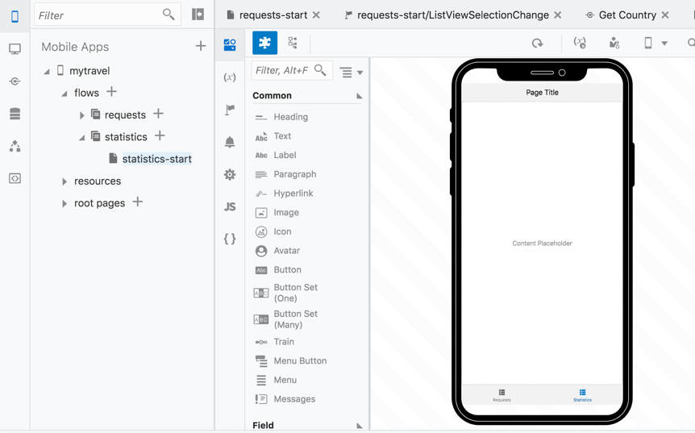
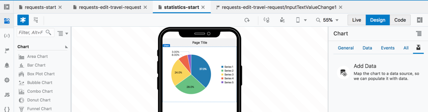
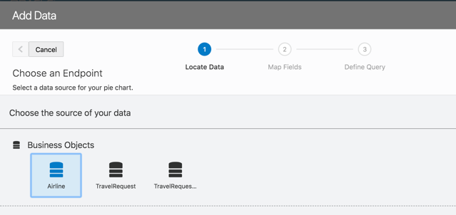
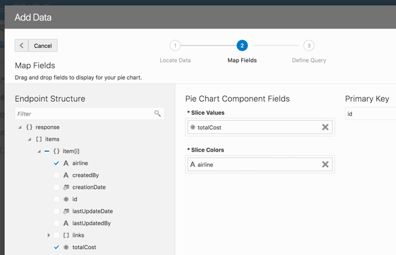
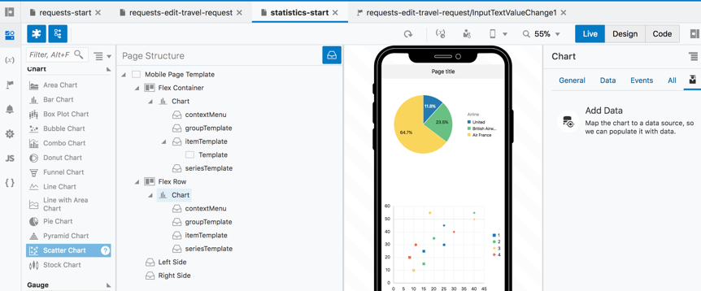
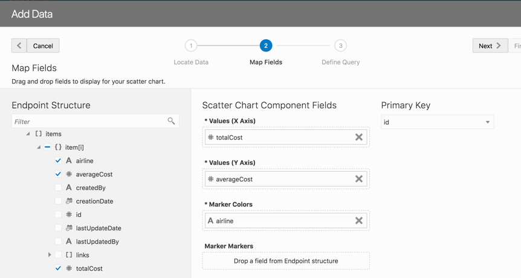
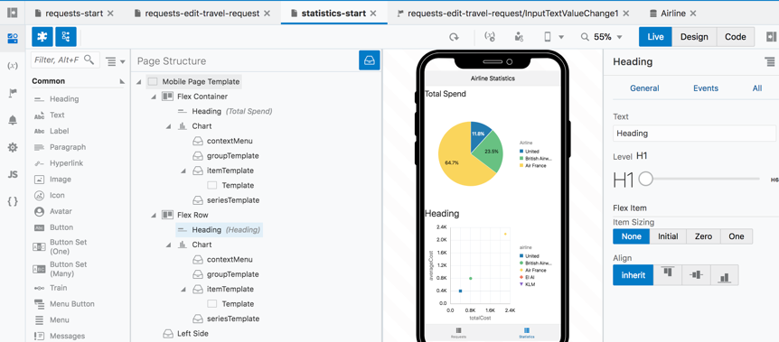
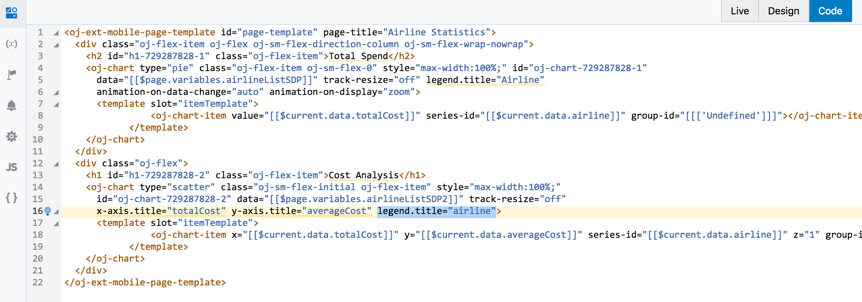

# 9. Create Visualizations of Data

*이번 섹션에서는 실습의 시작에서 생성한 Statistics 탭에 몇가지 비주얼 컴포넌트들을 추가할것입니다.*

메인 **Application Navigator** 에서 모바일 어플리케이션 **myTravel** 을 펼칩니다.

우리가 작업한 **requests** flows 아래에 있는 **statistics** flow의 default 페이지인 **`statistics-start`** 를 클릭해서 **Visual Editor** 를 오픈합니다.

 

### Add Data Visualizations to a Page

**Component Navigator** 에서 **Pie Chart** 를 페이지위로 드래그합니다.

 

오른쪽의 **Add Data** 클릭 합니다.

**Airline Business Object** 선택 후 **Next** 버튼을 클릭 합니다.

 

**totalCost** 를 **Slice Values** 항목으로 드래그 합니다.

**airline** 를 **Slice Colors** 항목으로 드래그 합니다.

 

**Next** , **Finish** 버튼을 클릭 합니다.

Airline Business Object 의 데이터가 차트위에 즉시 그려집니다.

오른쪽에 있는 차트의 Property Palette 에서 **animation-on-display** 항목의 값을 **zoom** 으로 변경합니다.

**Flex Container** 를 페이지 위에 추가한 뒤 **Scatter Chart** 를 그 뒤에 드래그 합니다.

**Add Data** 를 클릭합니다.

 

**'Airline'** Business Object 를 선택 후 **Next** 버튼을 클릭합니다.

**totalCost** 필드를 **x Axis** 위로 드래그 합니다.

**averageCost** 필드를 **y Axis** 위로 드래그 합니다.

**airline** 필드를 **Marker Colors** 위로 드래그 합니다.

**Next**, **Finish** 버튼을 클릭합니다.

 

**Page Template** 의 Properties 에서 **Page Title** 을 **Airline Statistics** 로 입력합니다.

각 차트의 상단에 **Heading** 를 드래그 하고 이름을 입력합니다.

**Pie Chart** : **Total Spend**

**Scatter Chart** : **Cost Analysis**

각 차트의 **Animate on Display** 와 **Animate on Data Change** 속성을 테스트 해봅니다.
 

**Code** 탭을 클릭하면 원하는 경우 해당 페이지의 모든 요소들을 수정할 수 있습니다. 예를들어 **legend.title="Airline"** 를 찾아서 **legend.title="Airline"** 로 변경해보세요.

 

## 10. 어플리케이션 실행

마지막으로 다시 어플리케이션을 모바일 시뮬레이터에서 **Run** 하고 페이지를 이동해보고 데이터 업데이트 및 애니메이션을 확인해봅니다. Visual Builder로 돌아가 해당 속성을 변경하고 시뮬레이터 브자우저 탭을 새로고침해서 변경내용을 확인해봅니다.

*이로서 이번 실습이 마무리 되었습니다. 축하합니다. Business Objects, REST 서비스 호출 및 시각화를 갖춘 첫번째 모바일 어플리케이션을 생성했습니다.*

### 여유가 된다면 EXTRA도 따라해보세요.

---
> [`HOME`](../README.md) | [`PART 1`](README.md) | [`PART 2`](MOB_PART_2.md) | [`EXTRA`](MOB_EXTRA_1.md) | [`Connecting DevCS`](../DevCS/README.md)
