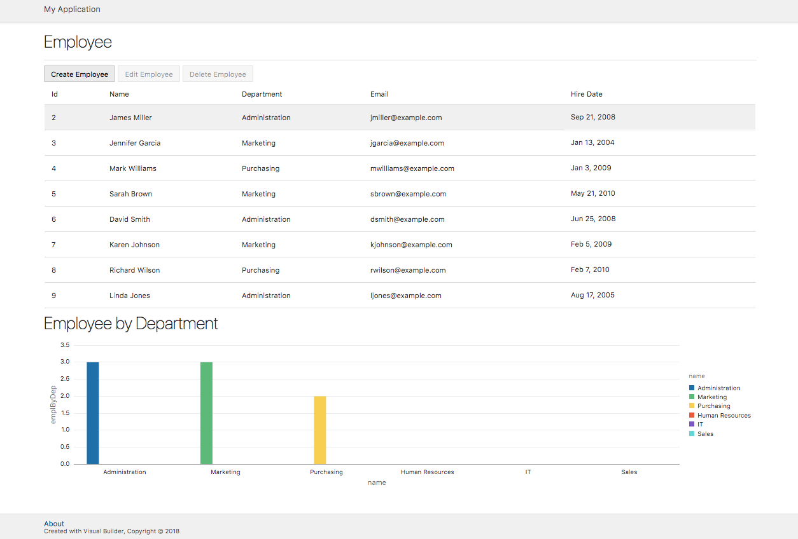

# ORACLE Cloud Test Drive: Autonomous Visual Builder Cloud Service

## Building MyFirstApp

### Introduction
The basic components of a visual application are mobile applications, web applications, service connections, business objects, and processes.

The basic building blocks of a mobile or web application are user interface (UI) components, variables, action chains, page flows and page navigation, and data access through REST endpoints.

The building blocks and their interactions can be summarized as follows.

+ **Variables** are the mechanism used to store and manage client state. Every variable has a type and a scope.

+ An **action chain** is composed of a set of one or more individual actions. The action chain is triggered by an event. (For example, a button click can trigger navigation to a page.) Each action represents a single asynchronous unit of work. An action chain can define input parameters and local variables that are available only in the context of that action chain, and can also access application-scoped input parameters and variables.

+ **Page flows** and page navigation govern the transmission of information from one page to another. Each individual page has a lifecycle, as does an application. Each lifecycle event (entry or exit from a page, for example) can provide a trigger for an action chain.

+ A **UI component** encapsulates a unit of user interface through a defined contract – specifically, the Oracle JavaScript Extension Toolkit (JET) components contract. Component properties are bound to variables, and component events trigger action chains.

All data entering a mobile or web application is based on REST. This data can come from custom business objects and from business objects provided by service connections. Actions and variables control how data is sent to and from a REST endpoint in a mobile or web application. A developer can create a type that matches the REST payload and pass the data using a variable of that type.

The following figure shows the interactions among these building blocks.

## What are you going to build
In this hands on lab you will be building a Simple HR application that features Employees, Departments and Locations.
Below a preview of the end result.

----
Have fun!

Continue with PART 1
> [HOME](README.md) | [PART 1](PART_1.md) | [PART 2](PART_2.md) | [PART 3](PART_3.md)

