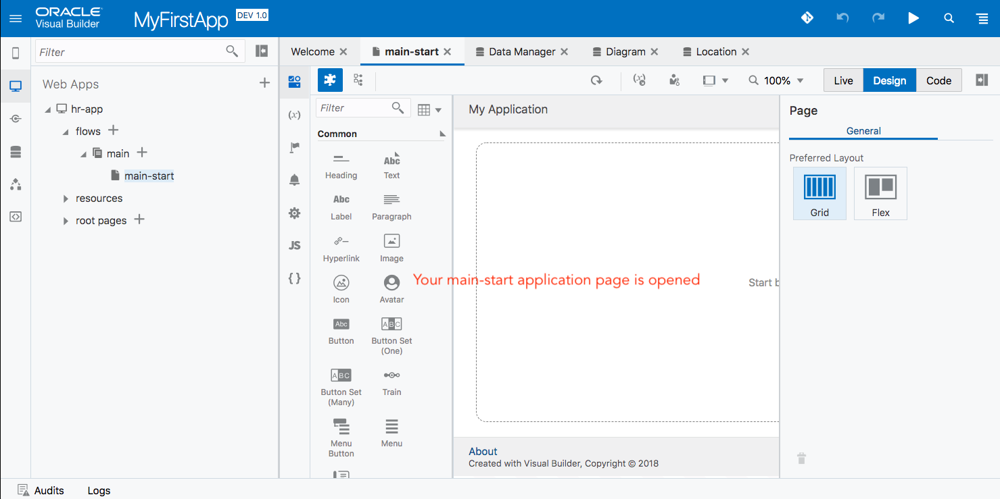
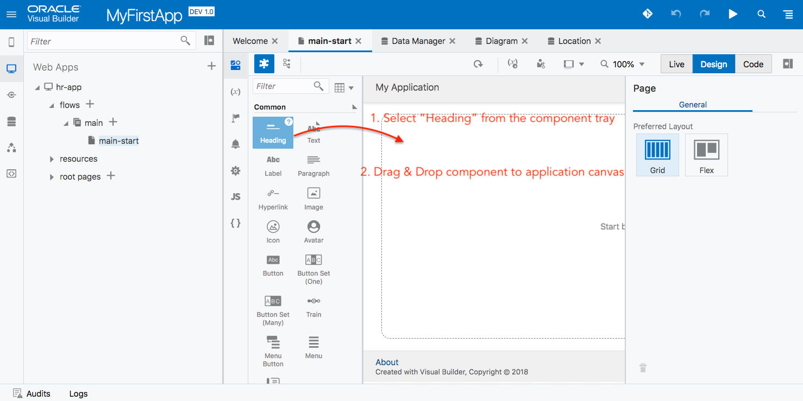
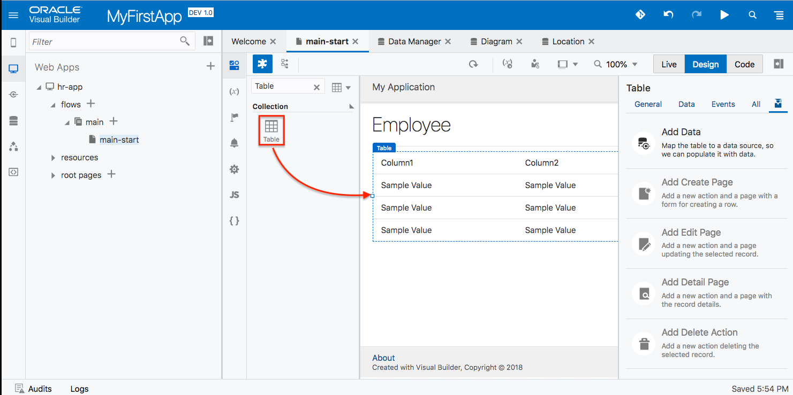
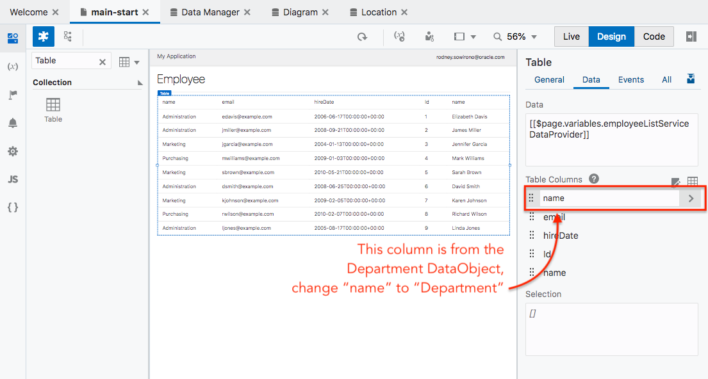
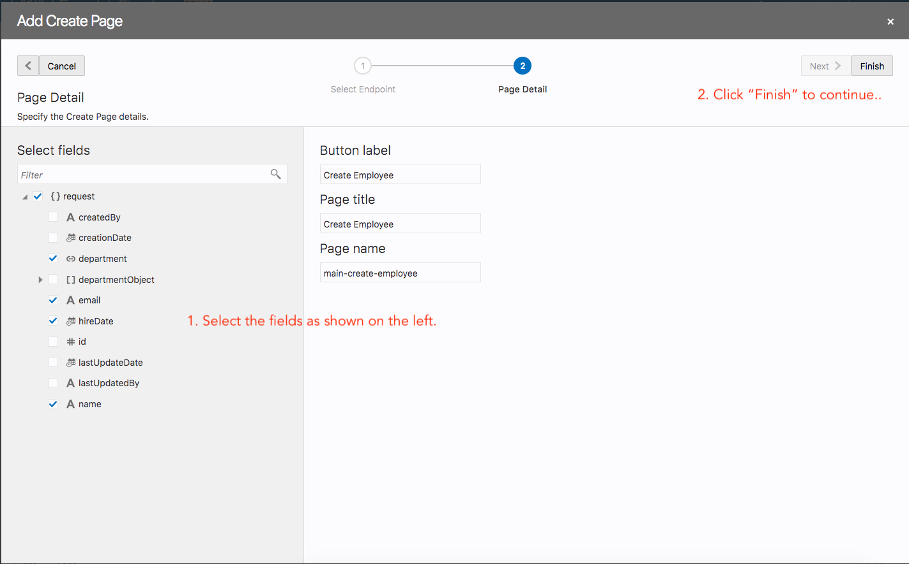
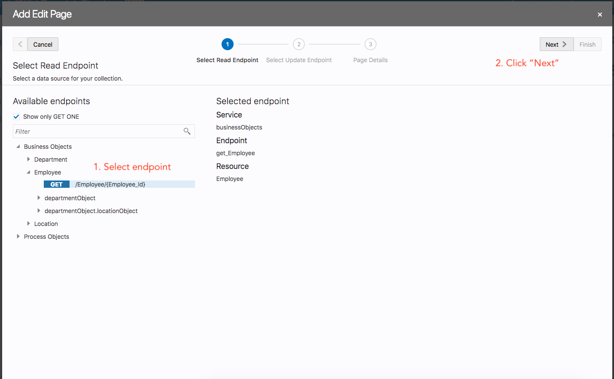
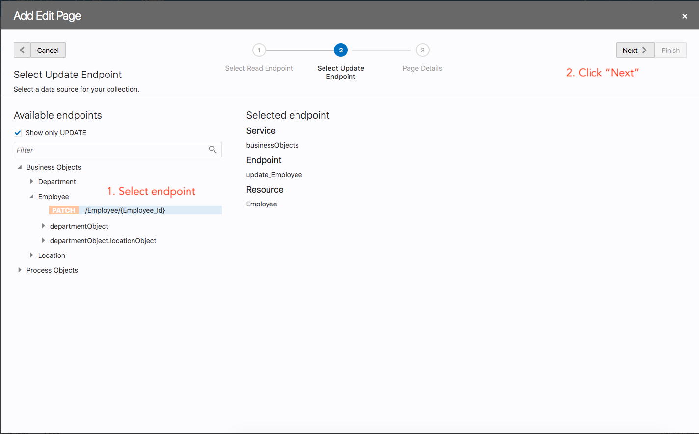
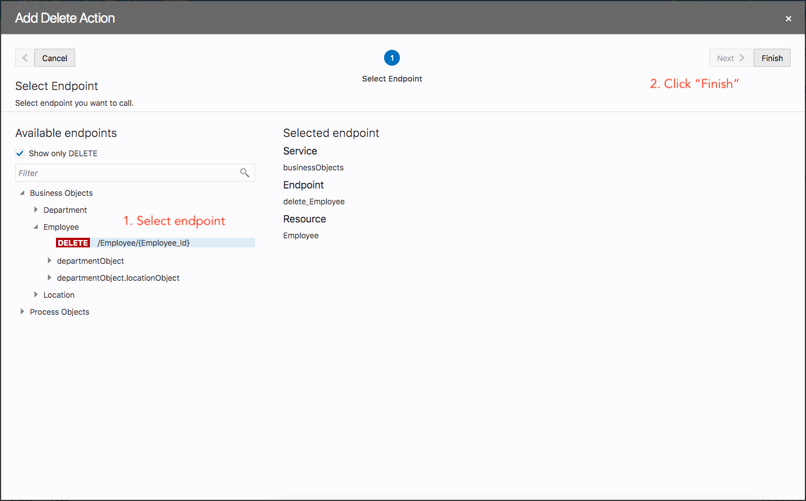

# Part 2: User Interface

## Introduction
In this part of the lab you will be creating a UI front end and bind the data from the BO's to the UI Components. You also will build, Create, Edit and Delete screens.

### Steps
----
> The next two steps is to get you to the main page of your application

> What we will start with is to place a header and a seperator line on to you main application page.

> Next is to add a Table Component in which we will expose the Employee data in to your main application page. You will be guided on retrieving data from the Employee Business Object and binding it to the UI Component.

> Now the Employee Data is presented in a table component, you might want to view the full page view. Instead of zoom in and zoom out each time, we can set the page to `fit`. The following steps will illustrate that.

> No we have a full view of the table, we most probably want to change the name or the sequence of the table columns. The following steps will guide you how this can be done.

> Now you're done with your table, next is adding some actions to the data. The next few steps will guide you on adding a Create Employee function and Edit Employee function. You will notice that VBCS has some nice prebuild quickstarts to help you generating the various pages and linking the navigation.

> We have completed creating the `Create Employee` page and we can now test this functionality.

> Next section of this lab, we will guide you on how to add a `Edit Employee` function. Before that we need to make sure we are back to out application `main-start` page.

> Before we move to our next section, we have to navigate back to our `main-start` page. We will guide you through a creation of the `Delete Employee` function.

Now you are ready to test and run your application. Click on the `Play` icon.

The result of your hard work.

----
### You have completed Part 2 of this lab. Proceed to Part 3.

## [Part 1](PART_1.md) | [Part 2](PART_2.md) | [Part 3](PART_3.md)
