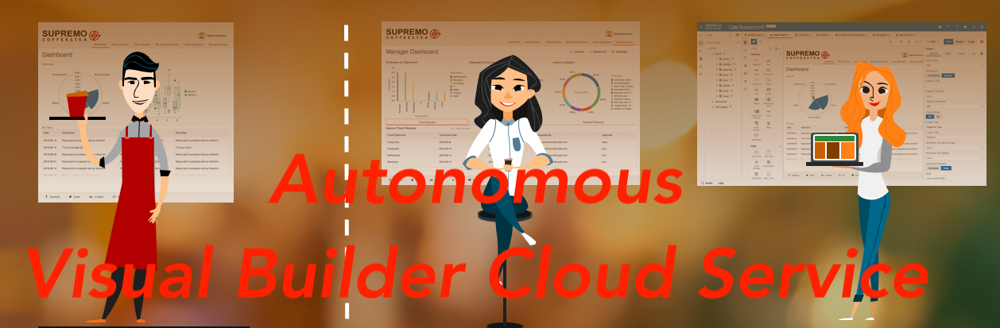

# ORACLE Cloud Test Drive: Autonomous Visual Builder Cloud Service

## Building Web & Mobile App without Coding!

### Introduction
코딩수업이 보통 초등학교 1학년부터 시작되고, 더이상 기계 처리 능력이 대부분의 컴퓨터 프로그램에서 중요한 요소가 아닌 지금 시점에서, 컴퓨터 프로그래밍은 “결함없는 코드 작성”에서 “혁신적인 아이디어의 실현”으로 발달되었습니다. 코드없이 프로그래밍하는 시대에 온 것을 환영합니다. 오라클 Autonomous를 통해 어떻게 어플리케이션 개발 영역에 Autonomous 요소를 적용할 수 있는지 경험해보십시오.

여기서 소개할 제품은 안전한 클라우드 환경에서 웹과 모바일 어플리케이션 개발 및 호스팅을 쉽게 할 수 있는 방법을 제공하는 Oracle Autonomous Visual Builder Cloud Service 입니다. Visual Builder Cloud Service(이하 VBCS)는 완전한 개발 및 호스팅 플랫폼 위에 직관적인 비주얼 개발경험을 제공함으로써 어플리케이션 개발 과 프로비저닝의 전체 사이클을 가속화하는 동시에 개방적인 표준 아키텍처를 활용합니다.

### Provisioning VBCS Instance
아래 링크는 Autonomous VBCS를 프로비저닝 하는 과정을 보여주는 짧은 영상 입니다.

### VBCS Demo Web Application
This web application features a fictitious company Cafe Supremo, human resources portal. This portal has been fully build using Visual Builder. Below the story board and the source of the application. You can download and import into your own Visual Builder Cloud instance.

+ [Cafe Supremo Demo App](CF-Demo-App.md)

### Labs
The following labs will run show you step by step how you can build a Mobile and Web Application in Oracle Visual Builder
+ [Lab 1: Building a myTravel Mobile App with Visual Builder Cloud](MobileApp/MOB_PART_1.md)
+ [Bonus Lab: My First Application (Web Application)](WebApp/MyFirstApp.md)
+ [Bonus Lab: Setting up Developer Cloud for Visual Builder](DevCS/README.md)
