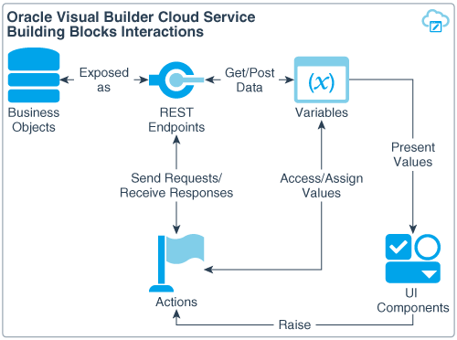
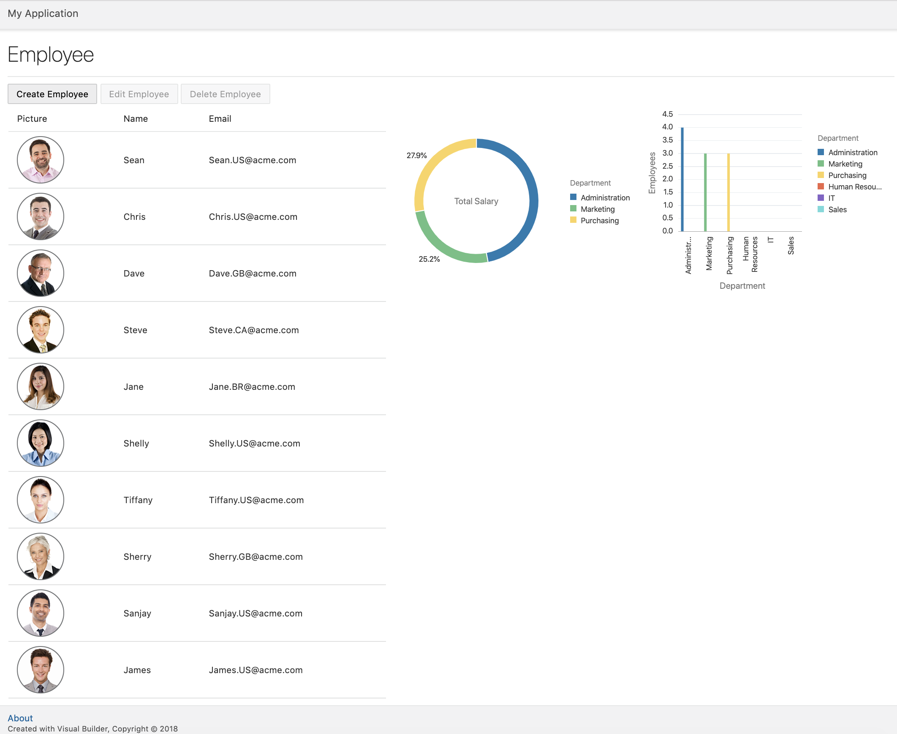

# ORACLE Cloud Test Drive: Autonomous Visual Builder Cloud Service

## MyFirstApp 만들기

### 소개
Visual Builder Cloud Service 어플리케이션의 기본 컴포넌트는 Mobile Applications, Web Applications, Service Connections, Business Objects, Processes 가 있습니다.

Mobile 또는 Web Application의 기본 구성 요소는 User Interface(UI) 컴포넌트, Variables, Action Chains, Page Flows, Page Navigation, REST endpoints를 통한 Data Access가 있습니다.

Building Block와 각각의 상호작용들은 다음과 같이 요약할 수 있습니다.

+ **Variables** 는 클라이언스 상태를 관리하고 저장하는데 사용되는 메커니즘입니다. 모든 변소는 type과 scope가 있습니다.

+ **action chain** 은 하나 이상의 개별 동작으로 구성됩니다. Action chain 은 event에 의해 트리거 됩니다. (예를들어, 버튼클릭시 페이지를 탐색하는 트리거) 각 작용은 단일 비동기 작업단위를 나타냅니다. Action Chain은 context 내에서만 유효한 input 파라메터와 지역변수를 정의할 수 있으며 또한 애플리케이션 범위의 input 파라메터와 지역변수에만 접근할 수 있습니다.

+ **Page flows** 와 Page Navigation은 한 페이지에서 다른 페이지로의 전달을 담당합니다. 각 페이지는 애플리케이션과 마찬가지로 라이프사이클을 가지고 있습니다. 각 라이프사이클 event(예. 페이지 접근 또는 아웃)는 Action Chain을 위한 트리거를 제공합니다.

+ **UI component** user interface 단위를 정의된 contract, 특히 Oracle Javascript Extension Toolkit (JET) 컴포넌트 contract를 통해서 캡슐화합니다.

모바일 또는 웹 어플리케이션에 입력되는 모든 데이터는 REST 기반입니다. 이 데이터는 custom Business Objects와 Service Connections에서 제공되는 Business Objects에서 얻을 수 있습니다. Actions 와 변수는 모바일, 웹어플리케이션에서 REST endpoint로 데이터를 주고 받는 방법을 제어합니다. 개발자는 REST payload와 일치하는 type을 생성하고 그 타입의 변수를 사용해서 데이터를 전달할 수 있습니다.

다음은 이러한 Building Block간의 상호작용을 보여줍니다.

## What are you going to build
이 실습에서는 사원, 부서, 지역을 관리하는 간단한 HR 웹어플리케이션을 생성할 것입니다.
아래는 완성한 결과입니다.

----
Have fun!

Part 1 으로 이어집니다..

> [`HOME`](../README.md) | [`PART 1`](PART_1.md) | [`PART 2`](PART_2.md) | [`PART 3`](PART_3.md)

