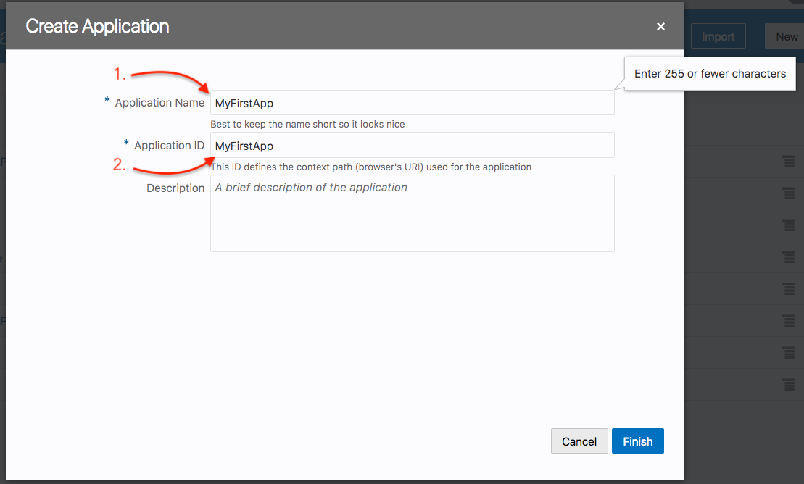
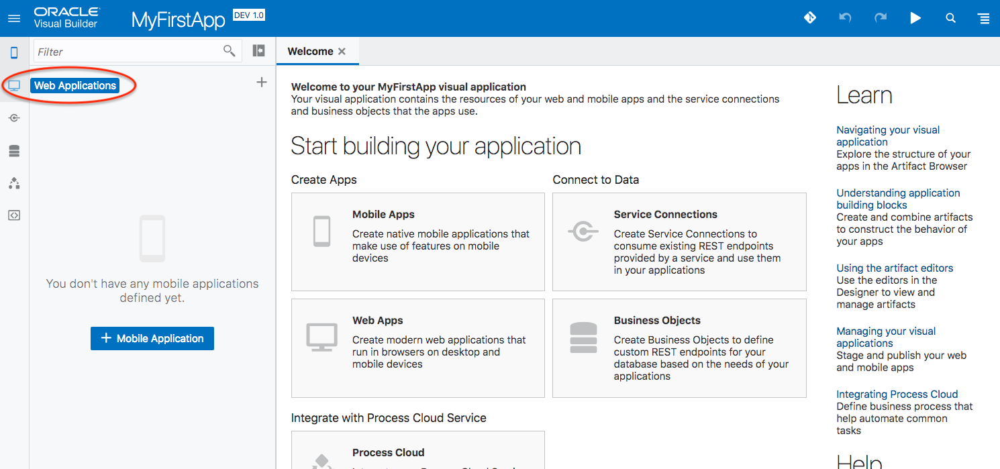
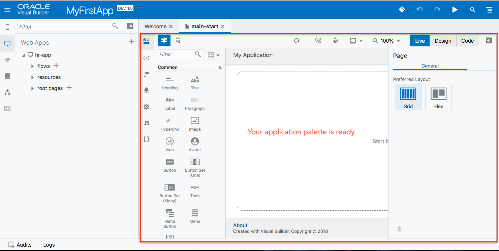
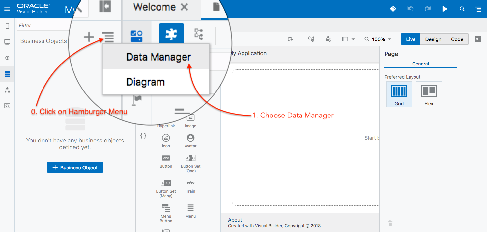
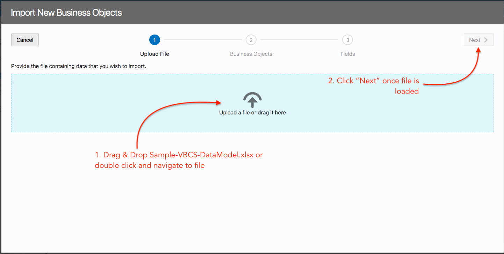
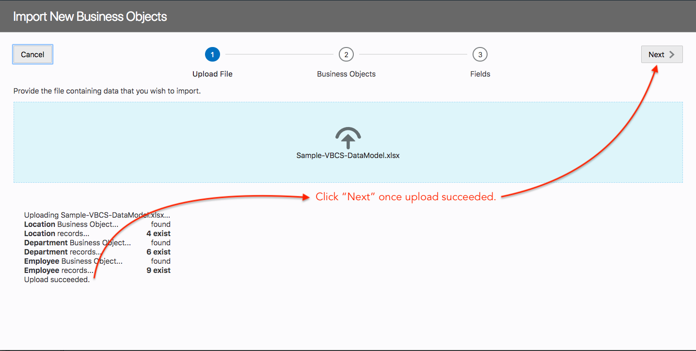
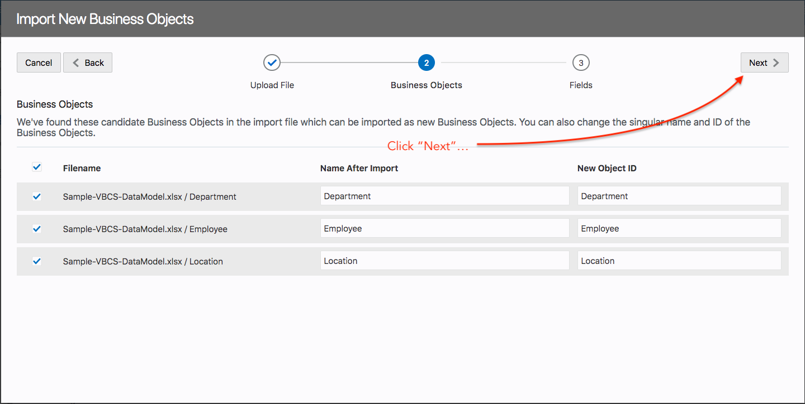
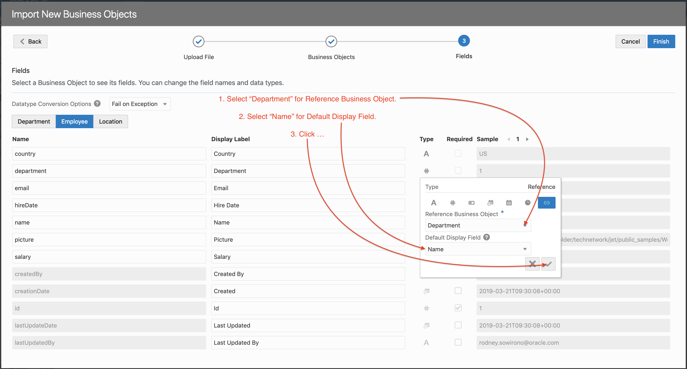
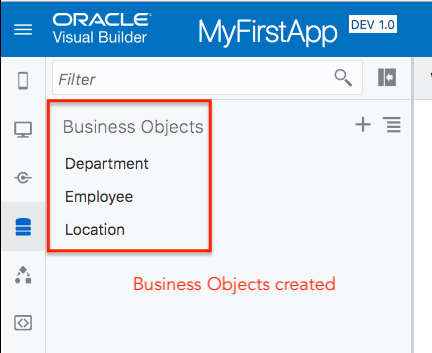
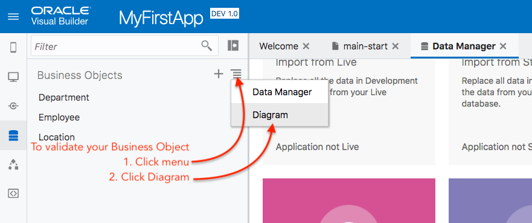

# Part 1: Business Objects 생성 (Data Model)
이 웹 어플리케이션을 생성하는 첫번째 파트는 Data Store를 생성하는 것입니다. 이 데이터 스토어는 어플리케이션에 입력될 데이터와 어플리케이션에서 사용될 데이터를 보관합니다. 데이터 입력 시간을 줄이기 위해서 샘플 데이터를 제공합니다. 이 VBCS의 Data Store는 Business Objects로 표현합니다. Business Object는 Database를 기반으로 합니다. (이 경우 Oracle Database Cloud)

이 실습 후 아래와 같은 Business Object 모델을 구축합니다.

아래 섹션에서는 위에서 보여지는 Business Object 모델을 생성하는 단계를 안내할 것입니다.

----
## Steps:
1. username과 password를 사용해서 VBCS에 로그인 합니다.

2. 어플리케이션을 구축하기 위해 새로운 project를 생성해야 합니다.

3. 필수 입력 필드를 채운 뒤 `Finish` 버튼을 클릭합니다.

4. VBCS 생성 툴이 열리면 왼쪽 메뉴바에 있는 `Web Applications` 아이콘을 클릭하세요. 그러면 VBCS의 Web Application 섹션이 열릴 것입니다. 이제 `+Web Application` 버튼을 클릭하세요.

5. 이제 웹 어플리케이션에 대한 ID를 제공하세요. `HR-App`를 ID로 입력하고 `Create` 클릭해 계속 진행합니다.

6. 어플리케이션 팔레트가 오픈될것이고 이제 어플리케이션을 생성할 준비가 되었습니다.
> hr-app tree에서 application flows, resources 그리고 root pages를 볼 수 있습니다. default 어플리케이션 이름은 `main-start`임을 기억하세요. 이 부분이 어플리케이션의 시작입니다.

7. 다음 이미지는 앞으로 생성할 Business Objects 의 상세 데이터 입니다.

> Business Objects 는 VBCS 인퍼페이스를 사용해서 생성하거나 직접 특정 Business Object 이름과 필드를 지정하거나 csv 또는 excel 파일을 사용해 하나 이상의 Business Objects를 import 하는 방법으로 생성할 수 있습니다. 이 실습에서는 import 하는 방법을 사용할 것입니다.

8. 다음 아이콘  를 클릭한 뒤 다음 화면에서 `download` 버튼을 클릭해서 VBCS Data Model 파일을 다운로드 하세요. 다음 실습을 위해 필요한 파일입니다.

> excel 파일에는 어떤 데이터가 있는지 한번 확인해보세요.

9. 이제 우리는 샘플 VBCS DataModel 파일을 다운로드 했고 Business Object를 생성할 준비가 됐습니다. 왼쪽 메뉴의 `Business Objects` 아이콘을 클릭하세요.

10. 아래 그림처럼 `햄버거` 메뉴 를 클릭한 뒤 `Data Manager` 메뉴를 클릭하세요.

> 이러면 다양한 선택이 있는 화면이 오픈될 것입니다.

11. `Import Business Objects`를 선택하세요. 그러면 다이얼로그 창이 오픈될 것입니다.

12. 이 다이얼로그 창에서 다운받은 엑셀파일을 `blue box`로 드래그앤 드랍하고 파일이 완전히 로드된 후 `next` 버튼을 눌러 다음으로 넘어갑니다.
> Business Object의 import는 세단계로 진행됩니다. 1. 파일업로드, 2. 생성할 Business Object의 `names` 확인, 3. BUsiness Objects에서 사용될 `Fields` 이름 확인.

13. 보여지는 이름 그대로 두고 `Next` 버튼을 클릭해서 다음으로 진행합니다.

14. 이 스테이지에서는 우리가 import 하려는 테이블들의 `Relationships`을 만들기 위해 일부 필드를 재구성 합니다. 첫번째는 `Department Business Object`로, Department BO와 Location BO의 관계를 일대다로 생성할 것입니다.

> 다음에 있는 그림을 따라 하세요.

15. 이제 Business Object가 생성되고 그 속으로 데이터가 import 되었습니다. `Close` 버튼을 클릭하세요.

16. 이제 어플리케이션을 위한 Business Object 가 생성된 결과를 볼 수 있습니다.

17. 생성된 Business Objects 모델 및 관계를 확인합니다. 아래 그림처럼 햄버거 메뉴를 클릭한 후 `Diagram` 메뉴를 클릭합니다.

18. 확인결과. 
> 결과로 Business Objects 의 관계를 볼 수 있습니다. 그리고 관계 선에 마우스를 대고 더블클릭하면 관계를 재구성할 수 있다는 것을 알 수 있습니다. 직접 해보세요!

이제 우리는 Part 1을 완료했습니다. 이제 이 실습의 Part 2를 따라해보세요.

> [`HOME`](../README.md) | [`PART 1`](PART_1.md) | [`PART 2`](PART_2.md) | [`PART 3`](PART_3.md)
