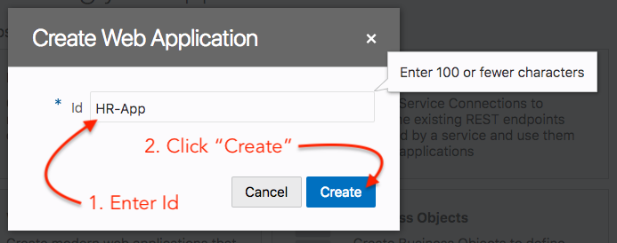

# Part 1: Business Objects 생성 (Data Model)
이 웹 어플리케이션을 생성하는 첫번째 파트는 Data Store를 생성하는 것입니다. 이 데이터 스토어는 어플리케이션에 입력될 데이터와 어플리케이션에서 사용될 데이터를 보관합니다. 데이터 입력 시간을 줄이기 위해서 샘플 데이터를 제공합니다. 이 VBCS의 Data Store는 Business Objects로 표현합니다. Business Object는 Database를 기반으로 합니다. (이 경우 Oracle Database Cloud)

이 실습 후 아래와 같은 Business Object 모델을 구축합니다.

아래 섹션에서는 위에서 보여지는 Business Object 모델을 생성하는 단계를 안내할 것입니다.

----
## Steps:
1. username과 password를 사용해서 VBCS에 로그인 합니다.

2. 어플리케이션을 구축하기 위해 새로운 project를 생성해야 합니다.

3. 필수 입력 필드를 채운 뒤 `Finish` 버튼을 클릭합니다.

4. VBCS 생성 툴이 열리면 왼쪽 메뉴바에 있는 `Web Applications` 아이콘을 클릭하세요. 그러면 VBCS의 Web Application 섹션이 열릴 것입니다. 이제 `+Web Application` 버튼을 클릭하세요.

5. 이제 웹 어플리케이션에 대한 ID를 제공하세요. `HR-App`를 ID로 입력하고 `Create` 클릭해 계속 진행합니다.

6. 어플리케이션 팔레트가 오픈될것이고 이제 어플리케이션을 생성할 준비가 되었습니다.
> hr-app tree에서 application flows, resources 그리고 root pages를 볼 수 있습니다. default 어플리케이션 이름은 `main-start`임을 기억하세요. 이 부분이 어플리케이션의 시작입니다.

7. The next images shows the details of the Business Objects you are going to create including the data. 

> You can create Business Objects in various ways either by creating it ussing the VBCS interface, where you manually specify the Business Object name and fields or import one or more BO's using a .csv or excel file. In this lab we will use the import method.

8. Click the next icon  and click `download` button on the next screen to download the VBCS Data Model file. You will need this file later in this lab.

> Take a look in the excel file and see what data.

9. Now we have downloaded the Sample VBCS DataModel file, we are ready to start building our BO's. Click on the `Business Objects` icon on the left menu.

10. Click on the `hamburger` menu (step: 0) as illustrated below and choose the `Data Manager` menu item (step: 1).

> This will open a screen with various choices

11. Choose `Import Business Objects`. This will open a dialog window.

12. In this dialog window, drag & drop the excel file into the `blue box`, once the file is totally loaded press next to continue.
> Import of a Business Object is done in three stages, 1. Upload file, 2. Verification of the `names` of the Business Objects that will be created, 3. Verification of the `Fields` that will be used in the Business Objects.

13. You can keep the names as shown, click `Next` to continue.

14. At this stage we want to reconfigure some of the fields as we would like to create `Relationships` between the tables we are importing. First is the `Department Business Object`, we would like to create a one-to-many relationship between the Department BO and the Location BO.

> Follow the instructions in the illustration.

15. Now the BO's are created and the data imported in the BO's. Click `Close` button to continue.

16. As a result you will now see that the BO's are created for your application.

17. To view the model and relationships between the BO's. Click on the hamburger menu as illustrated below and choose `Diagram`.

18. The results. 
> As a result you can see how the relationship between the BO's are and if you hover and click on the relationship links you can see that you can reconfigure it. Have a try!

We now have completed Part 1, please proceed to Part 2 of this lab.

> [`HOME`](../README.md) | [`PART 1`](PART_1.md) | [`PART 2`](PART_2.md) | [`PART 3`](PART_3.md)
