# Part 2: User Interface

## 소개
이번 실습에서는 front-end UI를 만들고 UI 컴포넌트로 Business Object의 데이터를 bind 할 것 입니다. 그리고 수정 화면과 삭제 기능 또한 구현할 것 입니다.

### Steps
----
#### 1. Header 추가
> 다음 두 단계에서는 이 어플리케이션의 메인페이지를 생성합니다.

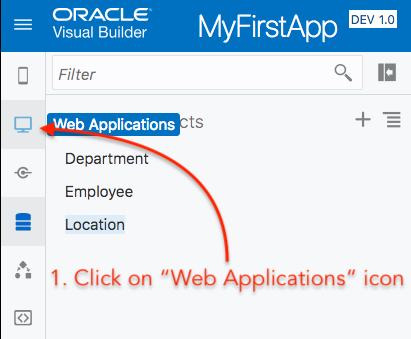 

> 이제 컴포넌트 팔레트에서 header 컴포넌트를 어플리케이션 메인화면의 캔버스로 드래그 앤 드랍하세요.

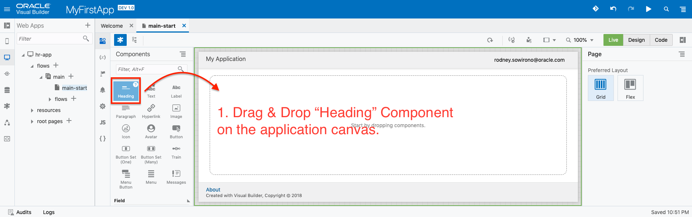

#### 2. 구분선 추가
> header 와 구분선 을 메인 어플리케이션 페이지에 추가 합니다.

#### 3. Table 추가
> 다음은 사원 데이터를 표시할 Table 컴포넌트를 어플리케이션 메인페이지에 추가합니다. Employee Business Object 에서 데이터를 검색하고 UI 컴포넌트에 binding 하는 방법을 가이드할 예정이니다.

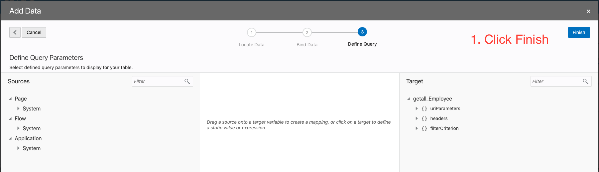

#### 4. view 조정하기
> 현재 사원 데이터 Table 컴포넌트에 나타나고 있고 이것을 full page view로 볼 수 있도록 하겠습니다. 페이지를 줌인, 줌아웃이 아닌 `Fit`되게 할 수 있습니다. 아래 그림에서 확인할 수 있습니다.

<!--
#### 5. Adjust Table
Now we have a full view of the table, we most probably want to change the name or the sequence of the table columns. The following steps will guide you how this can be done.

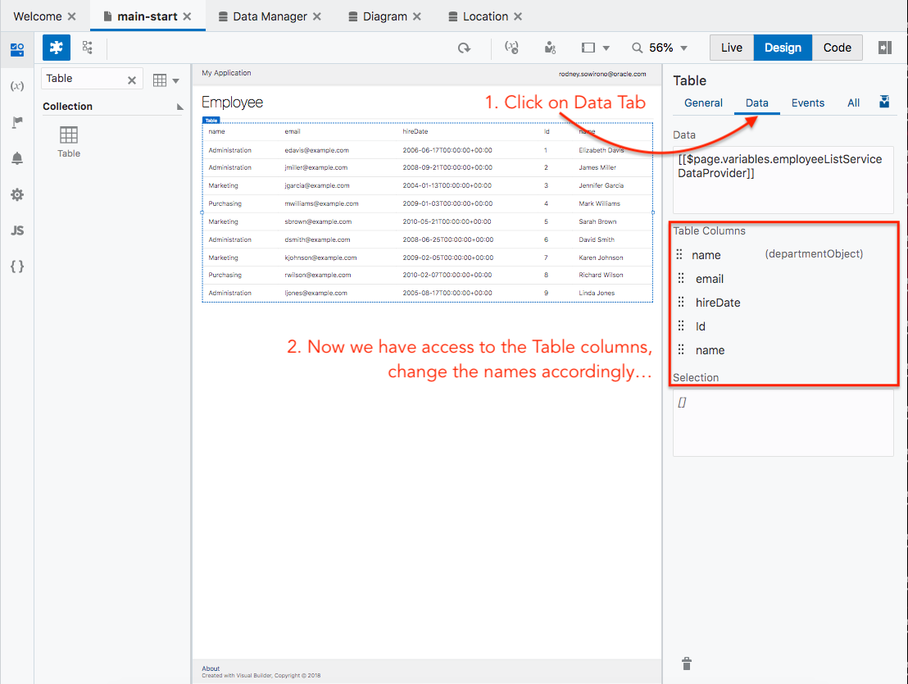

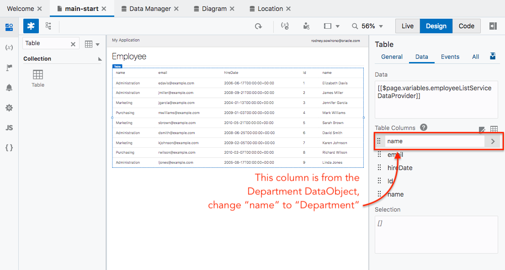

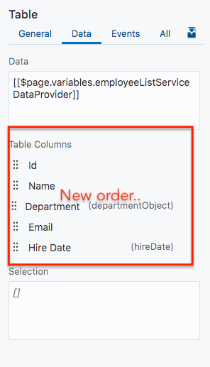

-->

#### 5. Change Picture component in Table
> Now we have a full view of the table, we most probably want to change the way we present the picture. The following steps will guide you how this can be done.

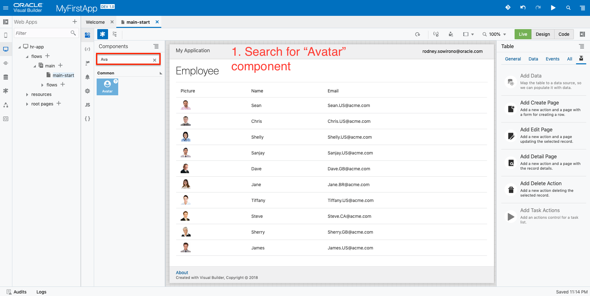

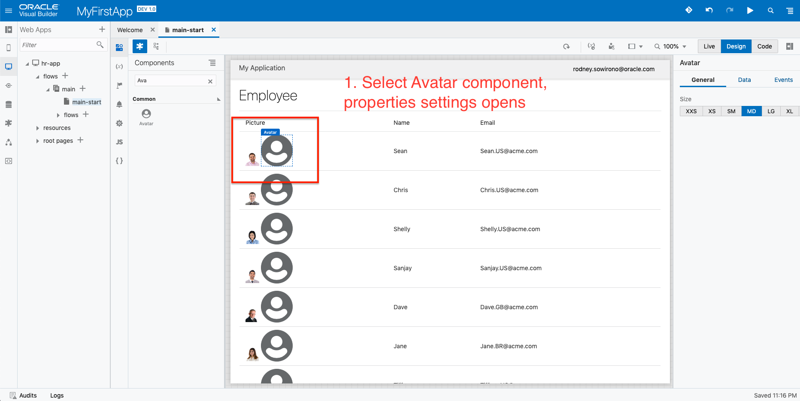

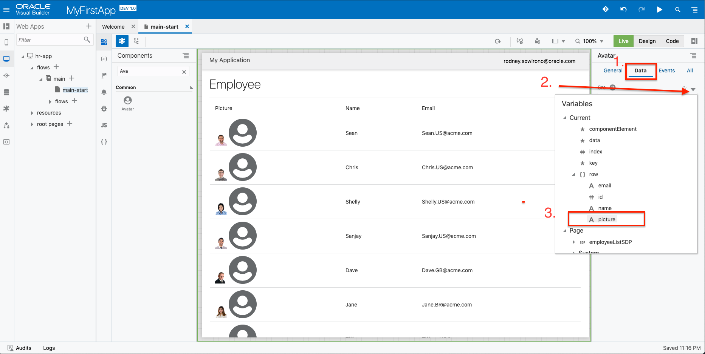

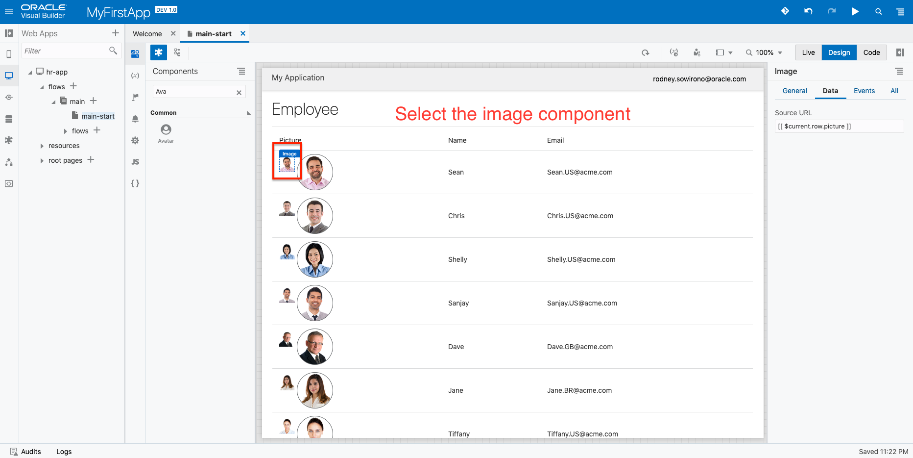

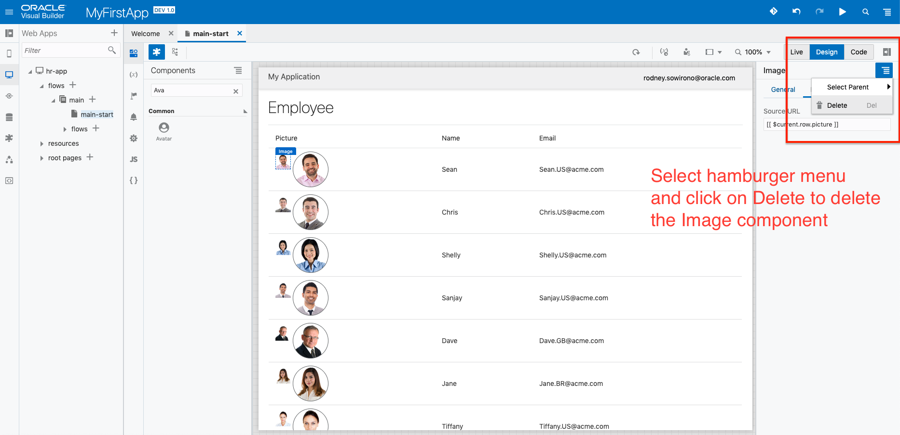

#### 6. Adding actions
> Now you're done with your table, next is adding some actions to the data. The next few steps will guide you on adding a Create Employee function and Edit Employee function. You will notice that VBCS has some nice pre-built quickstarts to help you generating the various pages and linking the navigation.

<!-- remove  -->

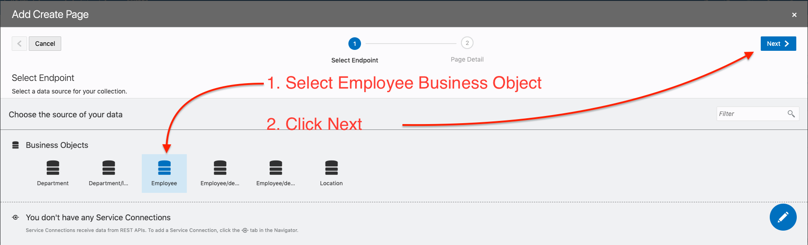

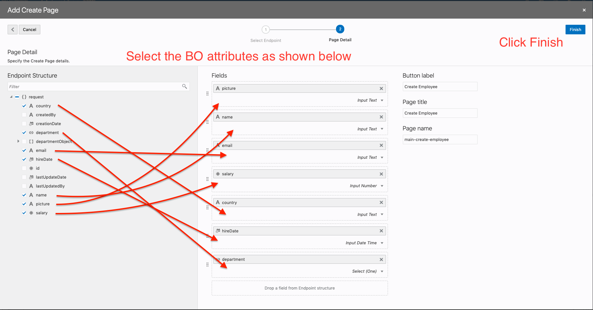

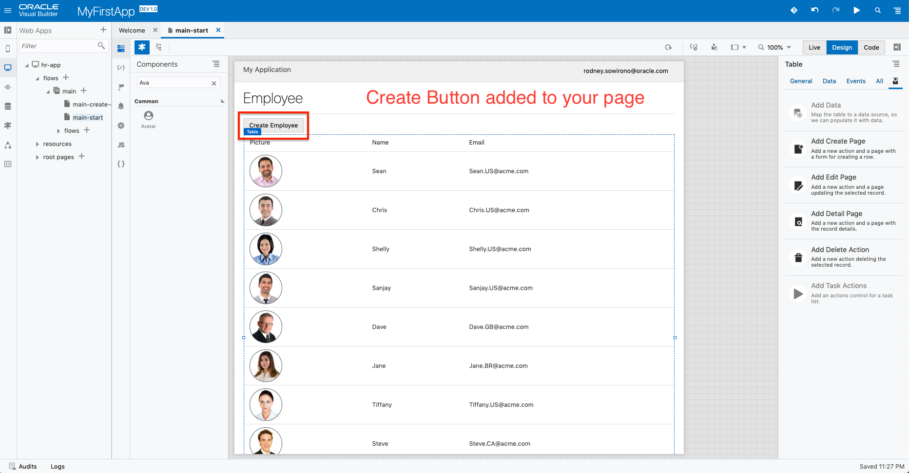

#### 7. Adding Create page
> We have completed creating the `Create Employee` page and we can now test this functionality.

<!-- remove  -->

#### 8. Adding Edit page
> Next section of this lab, we will guide you on how to add a `Edit Employee` function. Before that we need to make sure we are back to out application `main-start` page.

<!-- remove -->

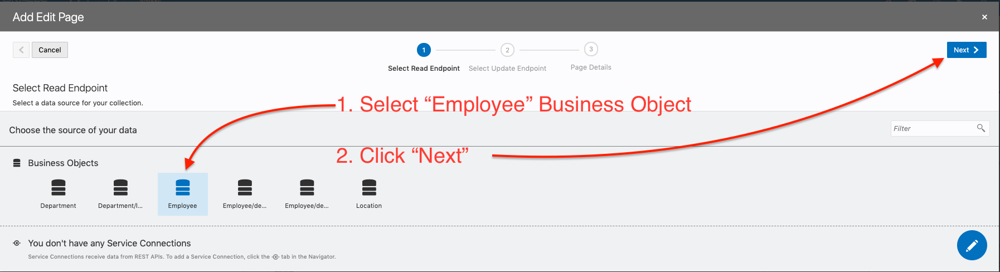

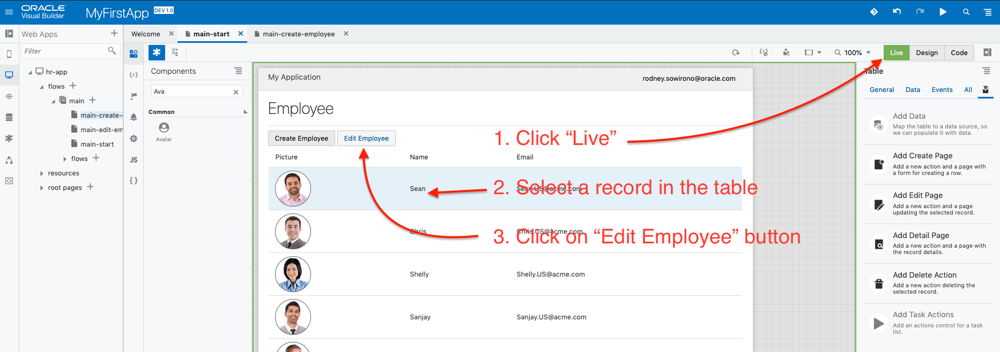

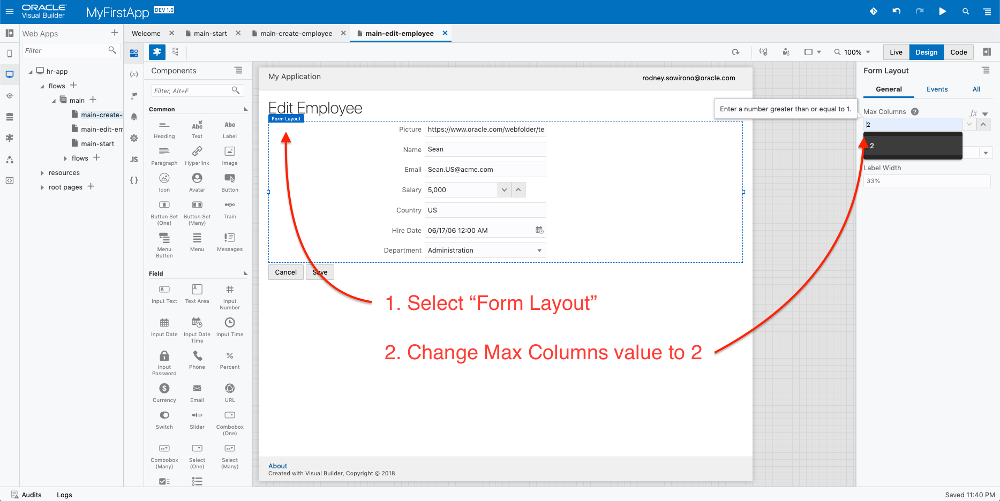

<!--  -->

#### 9. Adding Delete
> Before we move to our next section, we have to navigate back to our `main-start` page. We will guide you through a creation of the `Delete Employee` function.

<!-- remove  -->

#### 10. The results
Now you are ready to test and run your application. Click on the `Play` icon.

The result of your hard work.

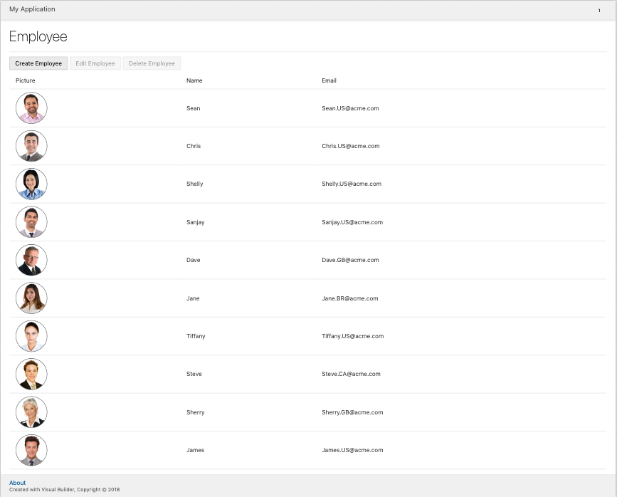
----
### You have completed Part 2 of this lab. Proceed to Part 3.

> [`HOME`](../README.md) | [`PART 1`](PART_1.md) | [`PART 2`](PART_2.md) | [`PART 3`](PART_3.md)
