# Part 2: User Interface

## 소개
이번 실습에서는 front-end UI를 만들고 UI 컴포넌트로 Business Object의 데이터를 bind 할 것 입니다. 그리고 수정 화면과 삭제 기능 또한 구현할 것 입니다.

### Steps
----
#### 1. Header 추가
> 다음 두 단계에서는 이 어플리케이션의 메인페이지를 생성합니다.

 

> 이제 컴포넌트 팔레트에서 header 컴포넌트를 어플리케이션 메인화면의 캔버스로 드래그 앤 드랍하세요.

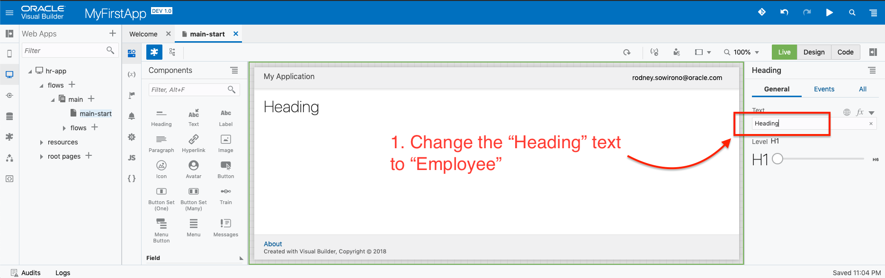

#### 2. 구분선 추가
> header 와 구분선 을 메인 어플리케이션 페이지에 추가 합니다.

#### 3. Table 추가
> 다음은 사원 데이터를 표시할 Table 컴포넌트를 어플리케이션 메인페이지에 추가합니다. Employee Business Object 에서 데이터를 검색하고 UI 컴포넌트에 binding 하는 방법을 가이드할 예정이니다.

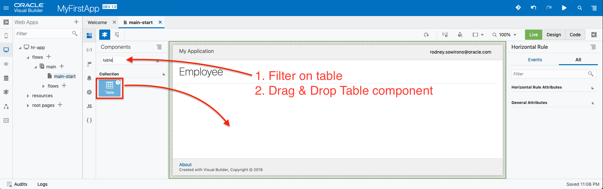

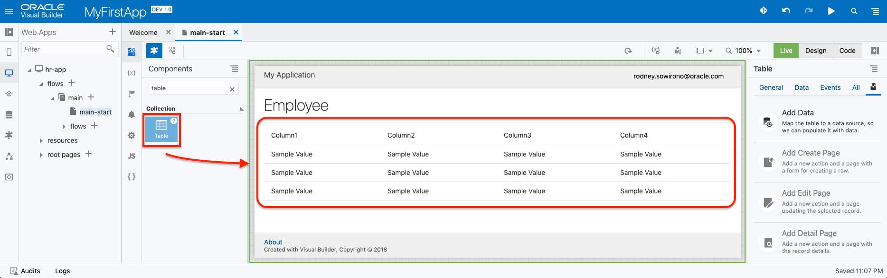

#### 4. view 조정하기
> 현재 사원 데이터 Table 컴포넌트에 나타나고 있고 이것을 full page view로 볼 수 있도록 하겠습니다. 페이지를 줌인, 줌아웃이 아닌 `Fit`되게 할 수 있습니다. 아래 그림에서 확인할 수 있습니다.

<!--
#### 5. Adjust Table
Now we have a full view of the table, we most probably want to change the name or the sequence of the table columns. The following steps will guide you how this can be done.

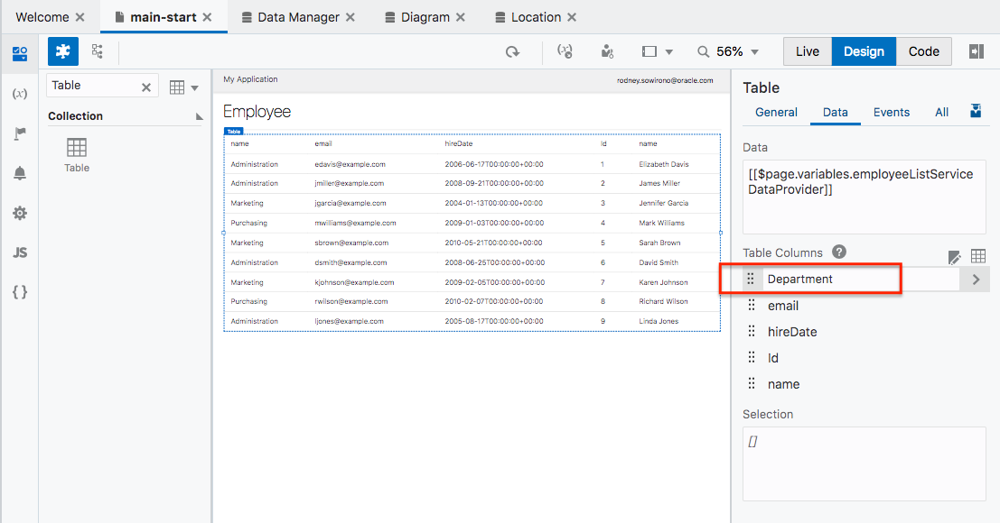

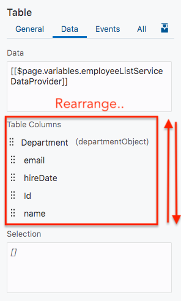

-->

#### 5. 테이블의 사진 컴포넌트 변경
> full 사이즈로 보여지는 현재 테이블에서 사진을 보여주는 방식을 변경해보겠습니다. 다음의 단계를 통해 어떻게 사진을 변경할 수 있는지 설명하겠습니다.

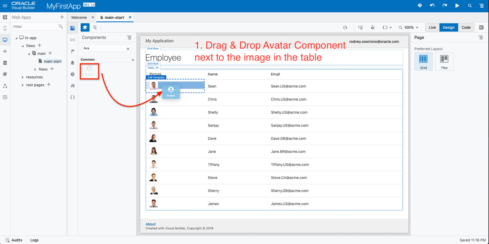

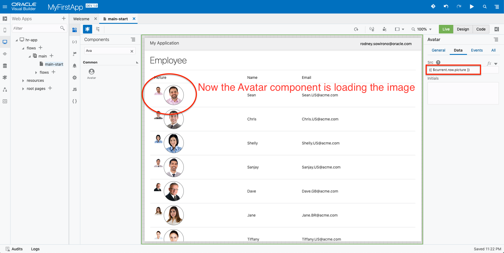

#### 6. actions 추가
> 이제 테이블에 대한 작업은 완료했고 다음은 데이터에 대한 몇가지 action 을 추가하겠습니다. 다음 몇가지 단계에서는 사원생성 및 수정기능을 추가하는 방법을 설명할 것입니다. VBCS에서는 다양한 페이지를 생성하고 네이게이션을 연결하는데 도움이 되는 기능들이 사전에 만들어져 제공됩니다.

<!-- remove  -->

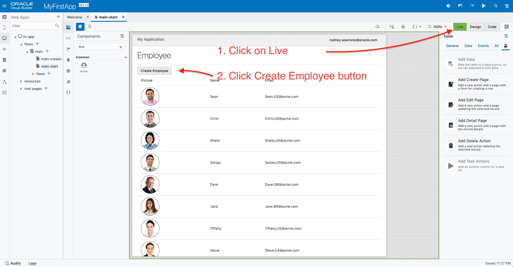

#### 7. 생성 페이지 추가
> `Create Employee` 페이지를 완성했고 이제 이 기능을 테스트 해봅니다.

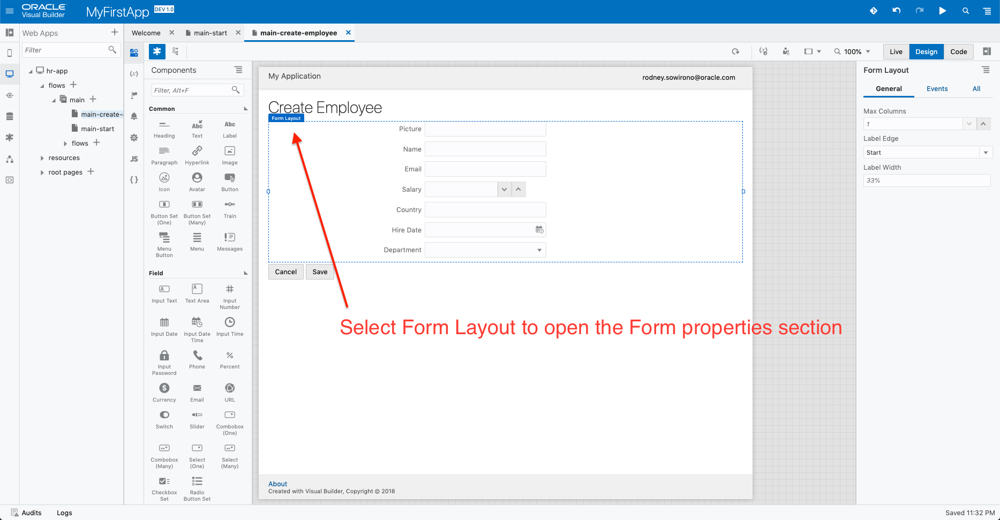

<!-- remove 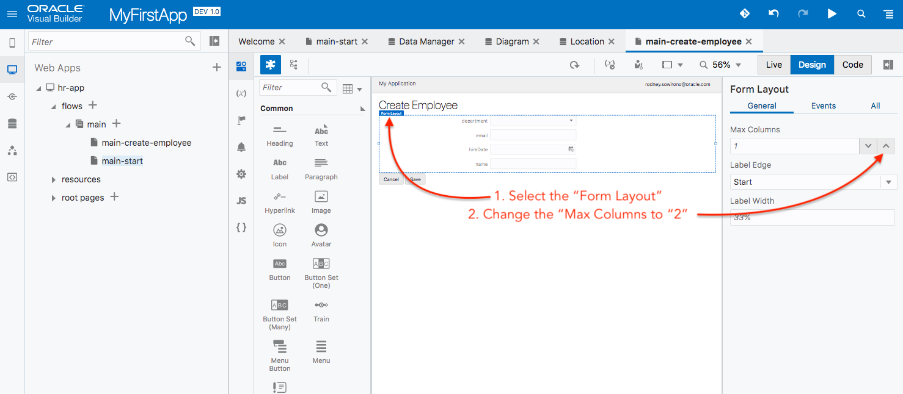 -->

#### 8. 수정 페이지 추가
> 이번 실습의 다음 섹션에서는 어떻게 `Edit Employee` 기능을 추가하는지 설명할 것입니다. 그러기 위해 먼저 이 어플리케이션의 `main-start` 페이지로 돌아갑니다.

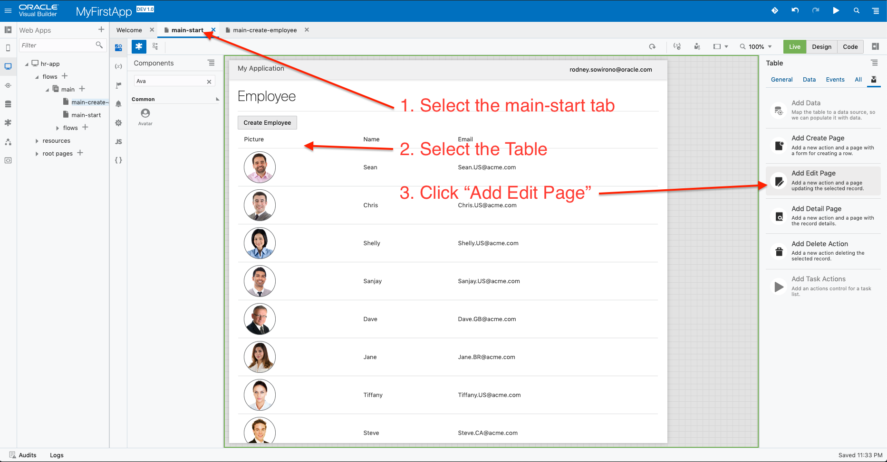

<!-- remove -->

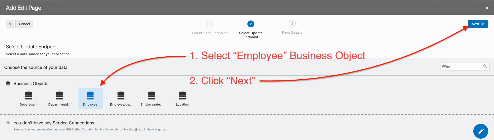

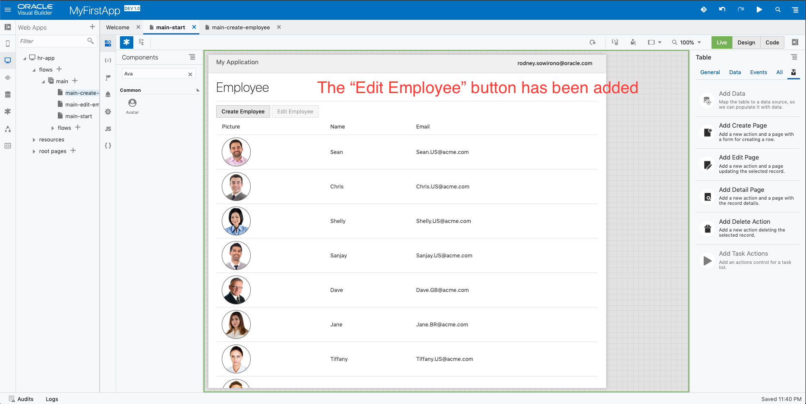

<!-- 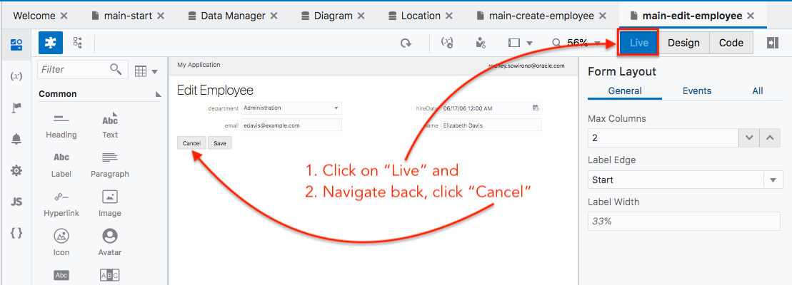 -->

#### 9. 삭제기능 추가
> 다음 섹션을 위해 `main-start` 로 돌아갑니다. 이제 `Delete Employee` 기능을 생성하는 방법을 설명하겠습니다.

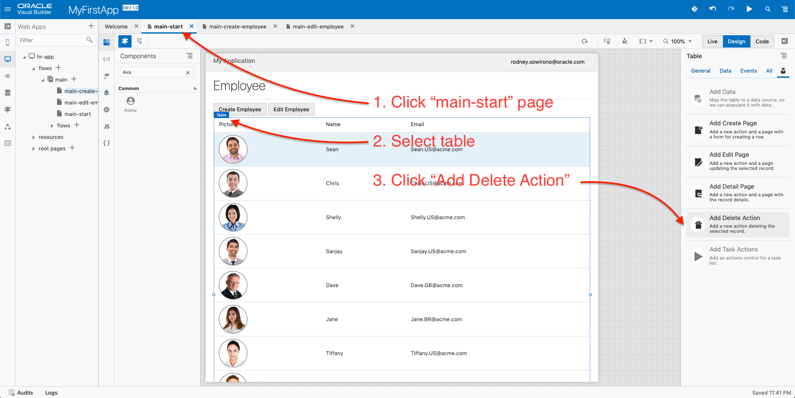

<!-- remove  -->

#### 10. 최종화면
이제 우리는 이 어플리케이션을 테스트 할 준비가 됐습니다. `Play` 아이콘을 클릭합니다.

어플리케이션의 최종화면 입니다.

----
### 이제 이 실습의 Part 2를 완료했습니다. 계속해서 Part 3을 실습해봅니다.

> [`HOME`](../README.md) | [`PART 1`](PART_1.md) | [`PART 2`](PART_2.md) | [`PART 3`](PART_3.md)
