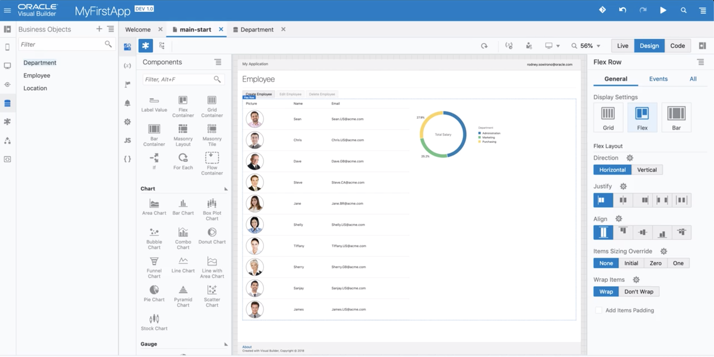
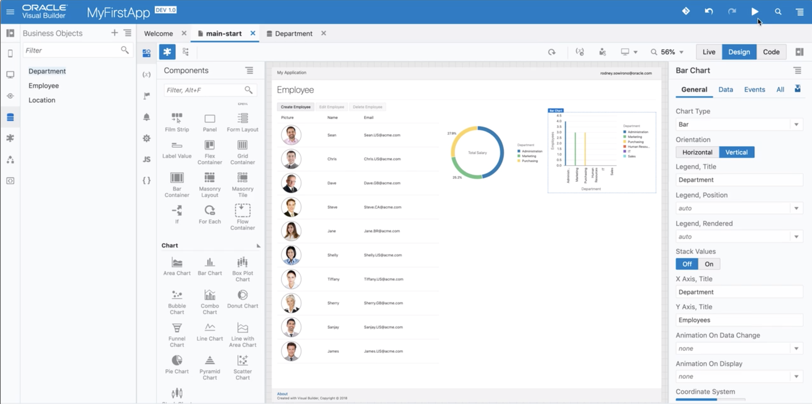

# Part 3: Adding a Graphs to your application

## 소개
이번 파트에서는 부서별 사원수 합계와 부서별 급여 합계를 보여주는 2개의 그래프를 이 어플리케이션에 추가할 것입니다.

### Steps
----
## 1. 부서별 급여 합계 그래프 추가

아래의 영상을 따라하세요.

> <a href="../resources/images/graph/CreateSalaryChart.mp4">Download Video</a>

## 2. 부서별 사원수 합계 그래프 추가

아래의 영상을 따라하세요.

> <a href="../resources/images/graph/CreateEmployeeChart.mp4">Download Video</a>

## 3. 이제 어플리케이션을 실행할 준비가 됐습니다. `preview` 버튼을 클릭하세요.

## Well done!! 이제 첫번째 웹 어플리케이션을 완성했습니다.

> [`HOME`](../README.md) | [`PART 1`](PART_1.md) | [`PART 2`](PART_2.md) | [`PART 3`](PART_3.md)
